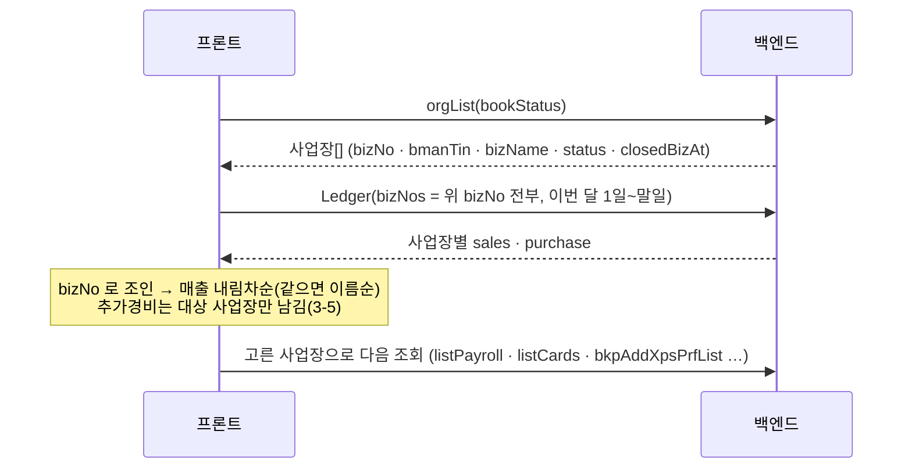
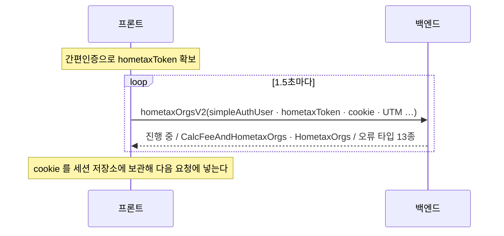
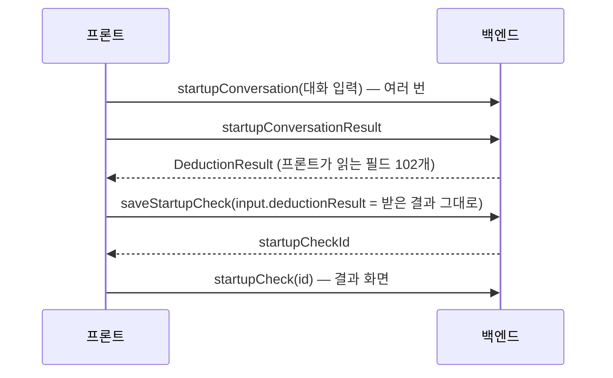

# 케어 웹 GraphQL → REST 전환 작업 문서

> 대상: 케어 사용자 웹 `care.bznav.com` (`bznav-web/apps/care-web`) · 기준 `bznav-web` `origin/dev` `dc6d98d29` (2026-10-08)
> 환급 웹(refund-web)은 `docs/handoff/refund-web-graphql-rest` 에 따로 있다. 형식은 같다.

이 폴더는 **백엔드와 프론트가 같이 보고 쓰는 작업판**이다. 백엔드는 REST 를 만들면서 아래 진행표의 `REST`·`백엔드` 칸을 채우고, 프론트는 그 API 로 바꾼 뒤 `프론트` 칸을 체크한다.

## 0. 이렇게 쓴다

**백엔드**
1. [4. 백엔드에 확인할 것](#4-백엔드에-확인할-것)에 먼저 답한다. 응답 형식·에러 형식·인증처럼 API 전체에 걸리는 결정이다
2. 도메인 문서(01~14)를 열어 API 카드마다 **요청 / 응답(프론트가 실제로 읽는 필드만) / 프론트가 분기하는 응답 타입**을 보고 REST 를 만든다
3. 만들면 카드와 진행표의 `REST` 칸에 `METHOD /path` 를 적고 `백엔드` 를 ☑. dev 에 배포되면 알려 준다
4. OpenAPI(Swagger) 문서에 올려 주면 프론트가 타입·호출 코드를 자동으로 만든다(orval)

**프론트**
1. 도메인 하나가 백엔드 ☑ 이 되면 그 도메인 문서의 **프론트 작업 파일**을 바꾼다 — 도메인 하나 = PR 하나
2. 바꾼 API 의 `프론트` 를 ☑. 같은 API 를 쓰는 파일을 모두 바꿔야 그 API 의 GraphQL 연산을 지울 수 있다
3. 전부 ☑ 이 되면 [6. Relay 걷어내기](#6-프론트--relay-걷어내기-마지막)

**제안하는 순서** (위험이 낮은 것부터, 백엔드 사정에 맞게 바꿔도 된다): 01 공통 → 03 이용료 조회 → 04 결제 → 12 연말정산 → 13 추가경비·카드 → 14 창업 점검 → 06·05·07 부가세 → 08·09 종소세 → 10·11 급여 → 02 홈택스. 전환 기간에는 **GraphQL 과 REST 가 같이 살아 있어야 한다.**

## 1. 숫자

| 항목 | 값 |
|---|---|
| 만들 API (GraphQL 루트 필드) | **184개** |
| 프론트 GraphQL 연산 | 188개 (조회 100 · 변경 88) — 같은 API 를 여러 화면이 다른 필드로 부르는 곳이 있어 API 수보다 많다 |
| 한 요청에 API 여러 개를 묶는 연산 | **0개** — 대신 API 하나가 큰 응답을 주고 화면이 나눠 그린다([3-1](#3-1-한-응답에-여러-화면의-데이터가-들어-있는-api)) |
| 응답이 union(성공·오류 타입)인 API | 178개 · 오류로 보이는 멤버 78종 · 프론트가 이름으로 분기하는 오류 50종([5-3](#5-3-응답-타입오류)) |
| 폴링 | 1곳 (1.5초) — `hometaxOrgsV2` |
| 파일 업로드 | **11개** (GraphQL multipart) — [5-4](#5-4-파일-업로드) |
| 인자 없이 토큰만으로 대상을 정하는 API | 39개 — [Q4](#4-백엔드에-확인할-것) |
| 프론트가 여러 API 를 이어 부르거나 합치는 곳 | 화면·훅 65곳 → [3-3](#3-3-앞-응답을-다음-요청에-넣는-흐름)·[3-4](#3-4-두-api-응답을-프론트가-합치는-곳)·[3-5](#3-5-프론트가-계산하는-업무-규칙) |
| 이미 REST 인 것 | 파일 다운로드 서버(`NEXT_PUBLIC_PDF_API_CARE_SERVER`)·소셜 로그인(`NEXT_PUBLIC_SSO_API_SERVER`) — 범위 밖 |
| 정의만 있고 안 쓰는 연산 | 없음 |

## 2. 도메인

| 문서 | API | 프론트 작업 파일 | 업로드 |
|---|---|---|---|
| [01. 공통·내 정보](./01-common.md) | 10 | 38 |  |
| [02. 홈택스 연동·수임 동의·4대보험](./02-hometax.md) | 11 | 64 |  |
| [03. 이용료 조회·가입](./03-pricing.md) | 5 | 12 |  |
| [04. 결제](./04-billing.md) | 12 | 46 |  |
| [05. 부가세 자료제출](./05-vat-material.md) | 33 | 121 | 6 |
| [06. 부가세 판매처(배달앱·온라인몰) 연동](./06-vat-connect.md) | 6 | 22 |  |
| [07. 부가세 예상세액·신고 결과](./07-vat-declare.md) | 9 | 33 |  |
| [08. 종소세 자료제출](./08-income-material.md) | 39 | 114 | 2 |
| [09. 종소세 진행·예상세액·신고 결과](./09-income-declare.md) | 13 | 40 |  |
| [10. 급여](./10-payroll.md) | 11 | 39 | 1 |
| [11. 알바 급여 계산](./11-part-time.md) | 10 | 31 |  |
| [12. 연말정산](./12-year-end-tax.md) | 7 | 22 | 1 |
| [13. 추가경비 증빙·사업용 카드](./13-expense-card.md) | 13 | 42 | 1 |
| [14. 창업 점검(세액공제·감면 진단)](./14-startup-check.md) | 5 | 16 |  |

## 3. 프론트가 조합해서 쓰는 것 — REST 설계 때 정할 부분

조사: 연산 188개를 스키마로 파싱하고, 화면·훅 import 를 따라가 **서로 다른 API 두 개 이상이 처음 만나는 곳 65곳**의 코드를 읽었다.

### 3-1. 한 응답에 여러 화면의 데이터가 들어 있는 API

한 요청에 API 여러 개를 묶는 연산은 없다. 대신 API 하나가 큰 중첩 응답을 주고 프론트가 fragment 로 나눠 여러 컴포넌트에서 그린다. **REST 에서 쪼개면 화면마다 요청이 늘고 순서가 생긴다 — 한 엔드포인트로 유지해 주면 좋다.**

| API | 들어 있는 것 (fragment 수) | 화면 |
|---|---|---|
| [`incomeTaxDeclareEstimatedTax`](./09-income-declare.md#09-06) | 사업·근로·금융 소득 목록, 공제·감면, 세율, 결과, 사용자 정보 (13) | 종소세 예상세액 |
| [`incomeMaterialMain`](./08-income-material.md#08-01) | 부양가족, 카드수수료, 기타 파일, 지방세, 본인 공제·추가 공제, 개인카드 수, 중소기업 감면 (8) | 종소세 자료제출 메인 |
| [`vatDeclareEstimatedTax`](./07-vat-declare.md#07-03) | 신고 정보, 전기 비교, 세액(공제·가산세·기납부 목록), 매입·매출 목록 (5) | 부가세 예상세액 |
| [`startupCheck`](./14-startup-check.md#14-04) | 업종, 등록 정보, 인허가(주·부), 공제 상세, 요약 (5) | 창업 점검 결과 |
| [`getPartTimeDetail`](./11-part-time.md#11-07) | 계산 결과, 일별 내역, 지급 상세, 주별 데이터 (4) | 알바 상세 |
| [`vatMaterialMain`](./05-vat-material.md#05-01) · [`vatDeclareResult`](./07-vat-declare.md#07-07) | 추가 자료·영수증·전체 상태 (3) · 상세·환급계좌·세액 결과 (3) | 부가세 |
| [`incomeTaxDeclareResult`](./09-income-declare.md#09-11) · [`smeTaxExemptionDetail`](./08-income-material.md#08-13) · [`donationInfo`](./08-income-material.md#08-16) · [`getWithholdingResultDetail`](./10-payroll.md#10-11) | 1~2 | |

중첩 목록이 있는 응답(장부 → 증빙, 카드 → 사용 내역, 급여 → 과세·비과세 수당 등) 21개도 지금은 한 번에 온다.

### 3-2. 같은 API 를 여러 화면이 다른 필드로 쓰는 것 · 비슷한 API 쌍

| API | 연산 | 비고 |
|---|---|---|
| [`vatMaterialMain`](./05-vat-material.md#05-01) | 3 | 메인 / 카테고리별 `submitCount` 가 **모두 0 인지** / `connectedCount` 가 **모두 없는지** — 프론트가 `Object.values(...).every(...)` 로 계산. 요약 필드(`hasAnySubmitted`·`hasAnyConnected`)를 주면 가벼운 확인이 된다 |
| [`getPartTimeDetail`](./11-part-time.md#11-07) | 3 | 상세 / 급여명세 / 저장된 일별 내역 중 **선택한 달 기록이 있는지**(`some(isSameMonth)`) |

같은 데이터를 두 API 로 받는 쌍 — 합칠지, 차이를 남길지 정해 주세요.

| 쌍 | 쓰는 곳 |
|---|---|
| [`hometaxOrgs`](./02-hometax.md#02-07) / [`hometaxOrgsV2`](./03-pricing.md#03-01) | 수임 동의 / 이용료 조회(폴링) |
| [`orgsRegularPaymentMethod`](./04-billing.md#04-01) / [`incometaxOrgsRegularPaymentMethod`](./04-billing.md#04-02) | 결제 / 종소세 결제 (`app/global-income/billing/hooks/useIncometaxOrgPaymentInfo.ts` 는 둘 다) |
| [`checkBankAccount`](./04-billing.md#04-07) / [`checkBankAccountForDeclare`](./09-income-declare.md#09-07) | 결제 계좌 / 신고 환급 계좌 예금주 확인 |
| [`incomeTaxDeclareResult`](./09-income-declare.md#09-11) / [`incomeTaxDeclareResultById`](./09-income-declare.md#09-13), [`vatDeclareResult`](./07-vat-declare.md#07-07) / [`vatDeclareResultById`](./07-vat-declare.md#07-09) | 최신 결과 / 이력 상세 |
| [`listPayroll`](./10-payroll.md#10-02) / [`listPayrollMonthly`](./10-payroll.md#10-03) | 월 급여 / 월별 상태 목록에서 `year·month` 로 찾아 상태 계산 |
| [`cardFileUpload`](./05-vat-material.md#05-16) / [`incomeTaxCardFileUpload`](./08-income-material.md#08-33) | 부가세 / 종소세 개인카드 파일 |

### 3-3. 앞 응답을 다음 요청에 넣는 흐름

**① 매출순 사업장 목록** — 급여·사업용 카드·추가경비·내 장부의 사업장 선택이 모두 이것 (29곳)

코드: `hooks/useGetOrgOrderBySales.ts`, `app/(my-info)/hooks/useGetOrgOrderBySales.ts`·`useLedgerSummary.ts`, `app/additional-expense/status/hooks/useOrgList.ts`, `app/payroll/hooks/useGetSelectedOrg.ts`. **사업장 목록 응답에 이번 달 매출·매입을 넣고 정렬해 주면 두 번이 한 번이 된다**(Q5).

**② 이용료 조회 — 홈택스 사업장 조회 폴링** ([03-01](./03-pricing.md#03-01))

코드: `app/pricing/(experiment)/verification/business-query/hooks/useGetHometaxOrg.ts`. REST 에서는 작업 시작(`POST`) → 상태 조회(`GET /jobs/{id}`) 를 제안한다(Q6).

**③ 환급 계좌 → 신고 확정** (한 흐름에 3번)
- 부가세: [`checkBankAccountForDeclare`](./09-income-declare.md#09-07) → [`declareRefundAccount`](./09-income-declare.md#09-08) → [`vatDeclareEstimatedTaxConfirm`](./07-vat-declare.md#07-06) — `app/vat/hooks/useAccountRefund.ts`
- 종소세: [`checkBankAccountForDeclare`](./09-income-declare.md#09-07) → [`declareRefundAccount`](./09-income-declare.md#09-08) → [`incomeTaxDeclareStageConfirm`](./09-income-declare.md#09-10) — `app/global-income/(auth)/refund-account/hooks/useUpdateDeclareRefundAccount.ts`. 확정이 `RequiredRefundAccountInput` 을 주면 [`getRfndAccs`](./01-common.md#01-04) 로 저장된 계좌가 있는지 보고 화면을 고른다(`estimated-tax/hooks/useEstimatedTaxComplete.ts`)
- 중간에 실패하면 앞 단계만 반영된다 → 한 엔드포인트로 묶을지(Q7)

**④ 부가세 "자료 없이 신고"** — [`savePassMaterialStatus`](./05-vat-material.md#05-04)(`passMaterialYn: true`) → [`vatMaterialComplete`](./05-vat-material.md#05-32) (`app/vat/submit-material/(submitMaterial)/(main)/hooks/useSubmitMaterial.ts`)

**⑤ 홈택스 비밀번호 변경** — [`hometaxChangePassword`](./02-hometax.md#02-04) → 새 비밀번호로 [`hometaxIdConnect`](./02-hometax.md#02-03) (`app/(auth)/(homeTax)/linkhometax/(nonStage)/passwordchange/hooks/useChangeHometaxPassword.ts`)

**⑥ 창업 점검 — 결과 왕복** ([14](./14-startup-check.md))

받은 결과를 그대로 되돌려 보낸다. **서버가 결과를 저장하고 ID 만 주면** 큰 데이터 왕복과 클라이언트 변조 여지가 없어진다(Q8).

**⑦ 레거시 추가경비 내역 — 페이지 전부 받기** — [`getXpsPrfSbmsBrkds`](./13-expense-card.md#13-07) 첫 응답의 `count` 와 `take`(최대 100)로 페이지 수를 계산해 나머지를 동시에 받고, `createdAt` 초 단위로 묶어 최신순(`app/additional-expense/history-legacy/hooks/useGetLegacyExpenseList.ts`). 전체를 한 번에 주거나 서버에서 묶어 주면 좋다

**⑧ 연말정산** — [`getYearEndTaxOrgs`](./12-year-end-tax.md#12-01)(사업자번호·연도) → [`getYearEndTaxEmployees`](./12-year-end-tax.md#12-02) → 직원별 [`getYearEndTaxFiles`](./12-year-end-tax.md#12-03)·[`getYearEndTaxCalcSummary`](./12-year-end-tax.md#12-07). 파일을 지워 마지막 한 개가 사라지면 직원 목록을 다시 받는다(`app/year-end-tax/[year]/[employeeId]/components/UploadContents.tsx`)

**⑨ 외부 파일 다운로드 링크** — [`issueTmpCrdtlsCer`](./02-hometax.md#02-05)(앱 안에서 임시 인증 발급) → 링크로 연 외부 화면에서 [`redeemTmpCrdtlsCer`](./02-hometax.md#02-06) → 파일 서버(REST) 다운로드

### 3-4. 두 API 응답을 프론트가 합치는 곳

| 합치는 것 | 프론트 동작 | 코드 | 제안 |
|---|---|---|---|
| [`deliveryAccountStatus`](./06-vat-connect.md#06-01) + [`onlineMallAccountStatus`](./06-vat-connect.md#06-02) | 두 목록을 이어 붙여 사업장(`bizNo`·`bmanTin`·`bizName`)으로 묶고 플랫폼별 `mallId`·`accountStatus` 배열을 만든다. 플랫폼+사업장으로 `mallId` 찾기 | `app/vat/hooks/useGetPreDeliveryPlatformInfo.ts` 외 서비스 연결 화면 (11곳) | 한 API 로(항목에 `platformType`), 아니면 두 API 를 같은 응답 모양으로 |
| [`rentInfoList`](./05-vat-material.md#05-17) + [`beforeRentInfoList`](./05-vat-material.md#05-18) | 두 목록 길이로 화면을 고른다(이번 것 있으면 계약 목록 · 이전 것만 있으면 이전 계약 불러오기). 이전 목록에서 고른 **배열 인덱스**로 항목을 꺼내 입력 화면에 쓴다 | `real-estate/page.tsx`, `contract-list/components/NoContract.tsx`, `input-loaded/hooks/useGetSelectedContract.tsx` | 두 API 유지 가능. 이전 계약 항목에 **안정적인 ID** 를 달아 주면 좋다 |
| [`vatCardDetail`](./05-vat-material.md#05-12) + [`orgMaterialDetail`](./05-vat-material.md#05-06) | 카드 사용 합계를 더하고, 업로드 파일은 제출자료 목록에서 `materialId` 로 찾는다 | `card-expense/detail/components/CardDetailView.tsx`, `preview/page.tsx` | 합계·파일을 상세 응답에 |

### 3-5. 프론트가 계산하는 업무 규칙

서버가 계산해 필드로 주면 웹·앱·콘솔이 같은 값을 쓴다. 그대로 둬도 전환은 된다(Q9). 65곳을 읽으며 찾은 것만 적었다 — 날짜·금액 포맷 같은 표시용 가공은 넣지 않았다.

| 규칙 | 코드 |
|---|---|
| 추가경비 대상 사업장: `계속사업자` 이거나, `휴업·폐업` 인데 `closedBizAt` 연도 ≥ 기준연도(6월 1일 전이면 작년, 이후면 올해) | `app/additional-expense/status/hooks/useOrgList.ts` |
| 종소세·지방세 금액: `type === 'Refund'` 면 음수로 바꿔 합산·표시 | `app/global-income/(auth)/estimated-tax/page.tsx` |
| 장부 요약 = 사업장별 `매출 − 매입` | `app/(my-info)/hooks/useLedgerSummary.ts` |
| 결제 미완료 사업장 = `nextBillingDate === null` | `app/(auth)/billing/hooks/useGetOrgsRegularPaymentMethod.ts` |
| 월 급여 상태 = 월별 목록에서 `year·month` 일치 항목의 `status` | `app/payroll/hooks/useGetPayrollStatusByMonth.ts` |
| 알바: 선택 월 일별 내역 필터·근무시간 합계 · 등록 여부(`workerId` 일치) · 지급 합계 | `PartTimeDetailWorkSummary.tsx`, `PartTimeEmployeeSelectDrawer.tsx`, `PartTimeMainContents.tsx` |
| 급여 직접 입력 확인 화면 합계 | `app/payroll/submit/manual/confirmation/page.tsx` |

### 3-6. 같은 화면에서 따로 부르는 것 — 백엔드 조치 없음

서로 값을 주고받지 않고 나란히 보여 준다. REST 에서도 각각 부르면 된다(프론트가 병렬로). 화면 첫 로딩은 그중 가장 느린 API 만큼 걸린다.
- `me`(구독 상태) + 홈 배너·링크(`hasPaymentOverdue`·`checkIncomeIntroStatus`), 창업 점검 결과, 결제 완료 화면
- 결제 수단 서랍 `myRegularPaymentMethods` + `orgsRegularPaymentMethod`·`paymentOverdueStats`
- 종소세 자료제출 메인·본인 공제·기타 서류·부양가족·중소기업 감면 화면의 2~4개씩
- 부가세 자료제출 메인(`vatMaterialMain` + `vatRecommendMaterial` + `orgCashSalesInfo`), 차량(`orgMaterialDetail` + `vatMaterialReusing`), 판매몰(`salesMallList` + 연결 현황)
- 연말정산 직원 + 파일·계산 요약, 이용료 결과(`leadCalcResultV2` + `promotionNotice`)

## 4. 백엔드에 확인할 것

| # | 질문 | 프론트 의견 |
|---|---|---|
| Q1 | OpenAPI(Swagger) 제공 · dev 주소 | 필수 — 프론트 타입·호출 코드 자동 생성(orval). `dev-api.care.bznav.com` 의 흔한 문서 경로 7곳은 404 였다 |
| Q2 | 업무 오류를 지금처럼 **200 + 응답 안의 타입 구분**으로 줄지, HTTP 상태 + `{ code, message }` 로 줄지 | 프론트는 공통 오류 객체로 받을 예정이라 둘 다 된다. **오류 타입 이름 → 코드 대응표**만 주면 된다([5-3](#5-3-응답-타입오류)). `message` 는 지금 문구 그대로 |
| Q3 | 성공인데 결과가 갈리는 응답(예 `RequiredRefundAccountInput`·`CalcFeeAndHometaxOrgs`/`HometaxOrgs`·`AllMaterialApplied.appliedYn`) | 오류로 바꾸지 말고 성공 응답 안의 구분 필드로 |
| Q4 | 인자 없이 토큰의 사용자·"현재 신고"로 대상을 정하는 API 39개(대부분 종소세)를 `/me/...` 처럼 유지할지, 연도·사업장을 명시하게 바꿀지 | 유지하면 프론트 변경이 적다. 바꾸면 프론트가 그 값을 어디서 얻는지도 정해야 한다 |
| Q5 | [3-3 ①](#3-3-앞-응답을-다음-요청에-넣는-흐름) 사업장 목록에 이번 달 매출·매입을 넣고 정렬해 줄 수 있는지 | 해 주면 좋다 — 29곳이 순차 호출 2번 |
| Q6 | 홈택스 사업장 조회 폴링을 작업 시작/상태 조회 API 로 | 폴링 간격·최대 시간 권장값도 |
| Q7 | [3-3 ③④⑤](#3-3-앞-응답을-다음-요청에-넣는-흐름) 연속 호출을 서버에서 한 번에 처리할지 | 환급 계좌 → 신고 확정은 묶어 주면 좋다 |
| Q8 | 창업 점검 결과를 서버가 저장하고 ID 만 줄 수 있는지 | 해 주면 좋다 |
| Q9 | [3-2](#3-2-같은-api-를-여러-화면이-다른-필드로-쓰는-것--비슷한-api-쌍) 요약 필드·비슷한 API 쌍 · [3-4](#3-4-두-api-응답을-프론트가-합치는-곳) 합치기 · [3-5](#3-5-프론트가-계산하는-업무-규칙) 업무 규칙 이관 | 하나씩 정해 주면 프론트가 맞춘다 |
| Q10 | 사업장 식별자 이름 — `bmanTin`(47 연산) · `bizno` · `bizNo`/`bizNos` · `bsno` · `rpnTin` 이 섞여 있다 | REST 에서는 같은 의미면 같은 이름으로 |
| Q11 | 인증 만료 신호 — 401 인지 | 지금 헤더(`Authorization: Bearer` · `X-Zent-Session-Id` · `X-Zent-Client-Session-Id`)를 그대로 받는지, CORS 도 |
| Q12 | 파일 업로드 규약 — 필드 이름·여러 파일·크기·확장자, 파싱(OCR)이 동기인지 | [5-4](#5-4-파일-업로드) |
| Q13 | 도메인별로 나눠 열지(0절 순서), 전환 기간에 GraphQL 을 유지할지 | 나눠서, 유지 |
| Q14 | 각 도메인 문서의 **설명 한 줄**은 스키마 설명을 옮겼다. 스키마 설명이 없거나 복사 실수로 보이는 23개는 이름·사용처로 고쳐 붙였다(카드에 표시) — 틀린 게 있으면 고쳐 주기 | |

## 5. 지금 요청·응답 규칙

### 5-1. 요청
- `POST` 한 곳(`NEXT_PUBLIC_GQL_API_CARE_SERVER`, dev `dev-api.care.bznav.com/graphql`)에 JSON `{ query, variables }` — 업로드만 multipart
- 헤더: `Authorization: Bearer <apiToken>` · `X-Zent-Session-Id` · `X-Zent-Client-Session-Id` (`libs/relay/fetchGraphQLFactory.ts`)
- 토큰이 없으면(로그인 전) `Authorization` 을 빼고 보낸다

### 5-2. 응답
- 대부분 **HTTP 200 + union**. 프론트는 `__typename` 으로 성공·오류·분기 화면을 고른다(약 110개 파일)
- 오류 멤버는 거의 `message` 를 가진다(공통 interface `BaseError`) — 프론트는 이 문구를 그대로 토스트로 띄우는 곳이 많다
- `TemporaryError` 는 union 178개 전부에 있다 — "잠시 후 다시" 공통 처리
- 날짜는 문자열이다. 프론트가 `substring`·정규식으로 잘라 쓰는 곳이 있으니 **지금 형식 그대로** 유지해 주세요. enum 값도 문자열 그대로 비교한다 — 각 도메인 문서의 "enum" 절

### 5-3. 응답 타입(오류)

오류로 보이는 union 멤버는 78종이다(이름 기준 추정). 그중 **프론트가 이름으로 비교해 화면을 나누는 것** 50종 — 코드로 바꾸면 대응표를 주세요. 괄호는 그걸 분기하는 API 수.

`TemporaryError`(28) · `IncomeMaterialAlreadyAppliedError`(10) · `VatMaterialAlreadyAppliedError`(8) · `HometaxExpiredSession`(3) · `BsnoInvalid`(3) · `YearendFailed`(3) · `HometaxOrgAlreadyCare`(2) · `HometaxOrgNotFound`(2) · `HometaxOrgOnlyPermanentlyClosed`(2) · `HometaxTimeout`(2) · `NoCareTarget`(2) · `NotEqualRpnTin`(2) · `TaxFreeBmanError`(2) · `IncorrectBankAccountNumber`(2) · `IncorrectBankAccountOwner`(2) · `InvalidInput`(2) · `HometaxBlockId`(1) · `HometaxPasswordError`(1) · `TmpCrdtlsCerAlreadyRedeemedOutput`(1) · `TmpCrdtlsCerExpiredOutput`(1) · `TmpCrdtlsCerNotFoundOutput`(1) · `CarePlusHistoryNotAllowedForDelegation`(1) · `IncorrectRegno`(1) · `AlreadyFourInsureDelegation`(1) · `NoFourInsureDelegation`(1) · `CarePlusHistoryNotAllowedForPricing`(1) · `CarePlusNotAllowedForPricing`(1) · `PgError`(1) · `PrePaymentFailed`(1) · `AlreadyPaid`(1) · `NoData`(1) · `DeliveryAccountError`(1) · `DeliveryBizNoError`(1) · `NeedAgreementError`(1) · `OnlineMallPendingError`(1) · `NoTargetVatDeclare`(1) · `FamilyRegistryCertLoginFailed`(1) · `FamilyRegistryCertSignFailed`(1) · `LocalTaxCertLoginFailed`(1) · `ScrapingLocalTaxExpiredSession`(1) · `ScrapingLocalTaxFailed`(1) · `YearendRpnTinMismatch`(1) · `IncomeTaxDeclareCancelled`(1) · `NoTargetIncomeTaxDeclare`(1) · `GetRefundClaimListRpnTinMismatch`(1) · `HometaxFailed`(1) · `NoIncomeTaxDeclareList`(1) · `NoIncomeTaxDeclareDetail`(1) · `YearEndTaxCalcSummaryNotFoundError`(1) · `UpdateNotAllowedStatus`(1)

프론트 상수: `apps/care-web/constants/error.ts` (`ERROR_TYPE`). API 별로는 각 카드의 "프론트가 분기하는 응답 타입" 줄.

오류로 보이는 멤버 전체 78종

`AccountInquiryRequestFailedOutput` · `AlreadyFourInsureDelegation` · `AlreadyPaid` · `AlreadySubAccount` · `AlreadyUploadedFile` · `BsnoInvalid` · `CarePlusHistoryNotAllowedForDelegation` · `CarePlusHistoryNotAllowedForPricing` · `CarePlusNotAllowedForPricing` · `CareUserForbiddenSubAccount` · `CreateLinkFailed` · `CrefiaAccountError` · `CrefiaBirthOrBizNoError` · `CrefiaLoginBlockError` · `CrefiaLoginError` · `CrefiaLoginIdError` · `CrefiaLoginPasswordError` · `CrefiaNotFoundOrgError` · `DeliveryAccountError` · `DeliveryBizNoError` · `ExpiredSubAccountLink` · `FamilyRegistryCertLoginFailed` · `FamilyRegistryCertSignFailed` · `GetRefundClaimListRpnTinMismatch` · `HometaxBlockId` · `HometaxExpiredSession` · `HometaxFailed` · `HometaxOrgAlreadyCare` · `HometaxOrgNotFound` · `HometaxOrgOnlyPermanentlyClosed` · `HometaxPasswordError` · `HometaxSimpleAuthTimeout` · `HometaxTimeout` · `IncomeMaterialAlreadyAppliedError` · `IncomeTaxDeclareCancelled` · `IncorrectBankAccountNumber` · `IncorrectBankAccountOwner` · `IncorrectCareUserBsno` · `IncorrectRegno` · `InvalidInput` · `LocalTaxCertLoginFailed` · `NeedAgreementError` · `NoCareTarget` · `NoData` · `NoFourInsureDelegation` · `NoIncomeTaxDeclareDetail` · `NoIncomeTaxDeclareList` · `NoMyBankAccount` · `NoPrevMilitaryPeriod` · `NoSubmittedDonationMaterial` · `NoSubmittedIncomeMaterial` · `NoSubmittedMaterial` · `NoSupportIndustry` · `NoTargetIncomeTaxDeclare` · `NoTargetVatDeclare` · `NoVatDeclareResultList` · `NotEqualRpnTin` · `NotFound` · `NotFoundOrgError` · `NotFoundOrgs` · `NotFoundVatDeclare` · `OnlineMallPendingError` · `PersonalCardParsingFailed` · `PgError` · `PrePaymentFailed` · `ScrapingLocalTaxExpiredSession` · `ScrapingLocalTaxFailed` · `SubAccountLimitExceeded` · `TaxFreeBmanError` · `TemporaryError` · `TmpCrdtlsCerAlreadyRedeemedOutput` · `TmpCrdtlsCerExpiredOutput` · `TmpCrdtlsCerNotFoundOutput` · `UpdateNotAllowedStatus` · `VatMaterialAlreadyAppliedError` · `YearEndTaxCalcSummaryNotFoundError` · `YearendFailed` · `YearendRpnTinMismatch`

### 5-4. 파일 업로드

11개: [`bkpAddXpsPrfParsingMultiple`](./13-expense-card.md#13-03) · [`incomeTaxCardFileUpload`](./08-income-material.md#08-33) · [`incomeFileUpload`](./08-income-material.md#08-35) · [`uploadPayrollFile`](./10-payroll.md#10-09) · [`cardFileUpload`](./05-vat-material.md#05-16) · [`insertTaxInvcInfo`](./05-vat-material.md#05-25) · [`taxInvcParsingMultiple`](./05-vat-material.md#05-24) · [`insertRentInfo`](./05-vat-material.md#05-20) · [`rentParsing`](./05-vat-material.md#05-19) · [`fileUpload`](./05-vat-material.md#05-29) · [`uploadYearEndTaxFile`](./12-year-end-tax.md#12-04)
- 지금은 GraphQL multipart 규약(`operations` · `map` · 파일 필드 `0, 1, 2…`, 파일 하나면 `input.file` 같은 경로)이다 — `libs/relay/fetchGraphQLFactory.ts`
- 파싱(OCR) API(`…Parsing…`·`rentParsing`·`cardFileUpload`)는 응답이 느릴 수 있다

## 6. 프론트 — Relay 걷어내기 (마지막)

모든 API 의 `프론트` 가 ☑ 이 된 뒤에 한다.

- [ ] `app/**/graphql/` 정의 파일 · 루트 `graphql/` · `schema/schema-care.graphql` · `__generated__/`
- [ ] `libs/relay/` (`relayEnvironment.ts` · `fetchRelayFactory.ts` · `fetchGraphQLFactory.ts` · `relayLogger.ts`)
- [ ] `libs/provider/relayProvider.tsx` 와 `app/GlobalProvider.tsx` 의 `<RelayProvider>`
- [ ] Relay 를 거치지 않고 `fetchGraphQLFactory` 를 직접 쓰는 7곳 (부가세 업로드·연결, 종소세 업로드, 창업 점검 입력)
- [ ] `relay.config.json`, `next.config.mjs` 의 `relay` 블록
- [ ] `package.json` 스크립트 `relay` · `gen:schema:dev` · `gen:schema:dev2` · `gen:schema:prd`, `dev`·`build` 앞의 `pnpm relay`
- [ ] 의존성 `react-relay` · `relay-runtime` · `@types/react-relay` · `@types/relay-runtime` · `graphql`. 버전은 catalog 라 **refund-web 도 다 바꾼 뒤** 루트 `pnpm-workspace.yaml` 에서 뺀다
- [ ] Relay 때문에 둔 `<Suspense>` 경계 정리(데이터 조회 라이브러리로 바꾸며 유지할 것만 남긴다)

## 7. 진행표 (184)

| ID | 도메인 | API | 종류 | 설명 | REST (백엔드 기입) | 백엔드 | 프론트 |
|---|---|---|---|---|---|---|---|
| [01-01](./01-common.md#01-01) | 공통·내 정보 | `me` | 조회 | 내 정보·구독 상태 조회 (스키마 설명 없음) | | ☐ | ☐ |
| [01-02](./01-common.md#01-02) | 공통·내 정보 | `orgList` | 조회 | 내 사업장 목록(장부 상태로 거름) (스키마 설명 없음) | | ☐ | ☐ |
| [01-03](./01-common.md#01-03) | 공통·내 정보 | `Ledger` | 조회 | 장부 | | ☐ | ☐ |
| [01-04](./01-common.md#01-04) | 공통·내 정보 | `getRfndAccs` | 조회 | 등록된 환급 계좌 조회 (스키마 설명 없음) | | ☐ | ☐ |
| [01-05](./01-common.md#01-05) | 공통·내 정보 | `registerRfndAcc` | 변경 | 환급 계좌 등록 (스키마 설명 없음) | | ☐ | ☐ |
| [01-06](./01-common.md#01-06) | 공통·내 정보 | `findMarketingTerms` | 조회 | 마케팅 수신 동의 조회 (스키마 설명 없음) | | ☐ | ☐ |
| [01-07](./01-common.md#01-07) | 공통·내 정보 | `approveMarketingTerms` | 변경 | 마케팅 수신 동의 (스키마 설명 없음) | | ☐ | ☐ |
| [01-08](./01-common.md#01-08) | 공통·내 정보 | `withdrawMarketingTerms` | 변경 | 마케팅 수신 동의 철회 (스키마 설명 없음) | | ☐ | ☐ |
| [01-09](./01-common.md#01-09) | 공통·내 정보 | `addSubAccount` | 변경 | 부계정 등록 | | ☐ | ☐ |
| [01-10](./01-common.md#01-10) | 공통·내 정보 | `mktEvent` | 조회 | 마케팅 이벤트(빌더 랜딩 /events) 조회 (스키마 설명 없음) | | ☐ | ☐ |
| [02-01](./02-hometax.md#02-01) | 홈택스 연동·수임 동의·4대보험 | `hometaxSimpleLogin` | 변경 | 홈택스 간편인증 step1 | | ☐ | ☐ |
| [02-02](./02-hometax.md#02-02) | 홈택스 연동·수임 동의·4대보험 | `hometaxSimpleLoginConfirm` | 변경 | 홈택스 간편인증 step2 | | ☐ | ☐ |
| [02-03](./02-hometax.md#02-03) | 홈택스 연동·수임 동의·4대보험 | `hometaxIdConnect` | 변경 | 홈택스 아이디 연동 | | ☐ | ☐ |
| [02-04](./02-hometax.md#02-04) | 홈택스 연동·수임 동의·4대보험 | `hometaxChangePassword` | 변경 | 홈택스 비밀번호 변경 | | ☐ | ☐ |
| [02-05](./02-hometax.md#02-05) | 홈택스 연동·수임 동의·4대보험 | `issueTmpCrdtlsCer` | 변경 | 파일 외부 다운로드용 임시 인증 발급 (스키마 설명 없음 — 추측) | | ☐ | ☐ |
| [02-06](./02-hometax.md#02-06) | 홈택스 연동·수임 동의·4대보험 | `redeemTmpCrdtlsCer` | 변경 | 임시 인증으로 외부 파일 다운로드 권한 교환 (스키마 설명 없음 — 추측) | | ☐ | ☐ |
| [02-07](./02-hometax.md#02-07) | 홈택스 연동·수임 동의·4대보험 | `hometaxOrgs` | 조회 | 홈택스 사업체 조회 (수임동의요청) | | ☐ | ☐ |
| [02-08](./02-hometax.md#02-08) | 홈택스 연동·수임 동의·4대보험 | `taxAgencyAgree` | 변경 | 홈택스 수임동의 | | ☐ | ☐ |
| [02-09](./02-hometax.md#02-09) | 홈택스 연동·수임 동의·4대보험 | `survey` | 변경 | 설문지 작성 | | ☐ | ☐ |
| [02-10](./02-hometax.md#02-10) | 홈택스 연동·수임 동의·4대보험 | `fourInsureDelegationOrgs` | 조회 | 4대보험 위임 대상 사업장 조회 (스키마 설명 없음) | | ☐ | ☐ |
| [02-11](./02-hometax.md#02-11) | 홈택스 연동·수임 동의·4대보험 | `fourInsureDelegationAgreement` | 변경 | 4대보험 위임 동의 (스키마 설명 없음) | | ☐ | ☐ |
| [03-01](./03-pricing.md#03-01) | 이용료 조회·가입 | `hometaxOrgsV2` | 조회 | 홈택스 사업체 조회 (이용료조회) | | ☐ | ☐ |
| [03-02](./03-pricing.md#03-02) | 이용료 조회·가입 | `leadCalcResultV2` | 조회 | 리드 견적 결과 호출 | | ☐ | ☐ |
| [03-03](./03-pricing.md#03-03) | 이용료 조회·가입 | `sendHookForPricingStart` | 조회 | 자동 견적 기장 시작 훅 | | ☐ | ☐ |
| [03-04](./03-pricing.md#03-04) | 이용료 조회·가입 | `saveLeadEmployeeInfo` | 변경 | 리드 근로자 정보 저장 | | ☐ | ☐ |
| [03-05](./03-pricing.md#03-05) | 이용료 조회·가입 | `promotionNotice` | 조회 | 프로모션 안내사항 | | ☐ | ☐ |
| [04-01](./04-billing.md#04-01) | 결제 | `orgsRegularPaymentMethod` | 조회 | 사업체별 결제 수단 | | ☐ | ☐ |
| [04-02](./04-billing.md#04-02) | 결제 | `incometaxOrgsRegularPaymentMethod` | 조회 | 종소세용 사업체별 결제 수단 | | ☐ | ☐ |
| [04-03](./04-billing.md#04-03) | 결제 | `myRegularPaymentMethods` | 조회 | 등록된 결제 수단 | | ☐ | ☐ |
| [04-04](./04-billing.md#04-04) | 결제 | `cmsRequiredOrgs` | 조회 | 출금동의 필요 사업체 | | ☐ | ☐ |
| [04-05](./04-billing.md#04-05) | 결제 | `hasPaymentOverdue` | 조회 | rpnTin 기준 미납 row 존재 여부 확인 | | ☐ | ☐ |
| [04-06](./04-billing.md#04-06) | 결제 | `paymentOverdueStats` | 조회 | 사업체별 미납 건수 및 총액 통계 | | ☐ | ☐ |
| [04-07](./04-billing.md#04-07) | 결제 | `checkBankAccount` | 조회 | 예금주 조회 | | ☐ | ☐ |
| [04-08](./04-billing.md#04-08) | 결제 | `initMyBankPayment` | 조회 | 헥토 내통장 결제 등록창 호출 | | ☐ | ☐ |
| [04-09](./04-billing.md#04-09) | 결제 | `createRegularPayment` | 변경 | 신규 정기결제수단 등록 | | ☐ | ☐ |
| [04-10](./04-billing.md#04-10) | 결제 | `refCreateRegularPayment` | 변경 | 기존 정기결제수단 참조 등록 | | ☐ | ☐ |
| [04-11](./04-billing.md#04-11) | 결제 | `prePayment` | 변경 | 선결제 | | ☐ | ☐ |
| [04-12](./04-billing.md#04-12) | 결제 | `createPaymentLink` | 변경 | 결제링크 생성 | | ☐ | ☐ |
| [05-01](./05-vat-material.md#05-01) | 부가세 자료제출 | `vatMaterialMain` | 조회 | 부가세 자료제출 메인 | | ☐ | ☐ |
| [05-02](./05-vat-material.md#05-02) | 부가세 자료제출 | `vatRecommendMaterial` | 조회 | 부가세 권장자료 안낸 목록 | | ☐ | ☐ |
| [05-03](./05-vat-material.md#05-03) | 부가세 자료제출 | `passMaterialStatus` | 조회 | 자료제출 없이 신고하기 여부 | | ☐ | ☐ |
| [05-04](./05-vat-material.md#05-04) | 부가세 자료제출 | `savePassMaterialStatus` | 변경 | 자료제출 없이 신고하기 상태 업데이트 | | ☐ | ☐ |
| [05-05](./05-vat-material.md#05-05) | 부가세 자료제출 | `saveFirstEnter` | 변경 | 첫 진입여부 업데이트 | | ☐ | ☐ |
| [05-06](./05-vat-material.md#05-06) | 부가세 자료제출 | `orgMaterialDetail` | 조회 | 사업체 제출자료 내역 | | ☐ | ☐ |
| [05-07](./05-vat-material.md#05-07) | 부가세 자료제출 | `materialFileDownload` | 조회 | 내 제출자료 다운로드 | | ☐ | ☐ |
| [05-08](./05-vat-material.md#05-08) | 부가세 자료제출 | `orgCashSalesInfo` | 조회 | 현금 신고 정보 | | ☐ | ☐ |
| [05-09](./05-vat-material.md#05-09) | 부가세 자료제출 | `salesMallList` | 조회 | 온라인 / 배달앱 매출 조회 | | ☐ | ☐ |
| [05-10](./05-vat-material.md#05-10) | 부가세 자료제출 | `vatMaterialReusing` | 조회 | 직전 신고 자료 가져오기 | | ☐ | ☐ |
| [05-11](./05-vat-material.md#05-11) | 부가세 자료제출 | `vatCardList` | 조회 | 사업자의 카드 리스트 조회 | | ☐ | ☐ |
| [05-12](./05-vat-material.md#05-12) | 부가세 자료제출 | `vatCardDetail` | 조회 | 부가세 개인카드 단건 상세 (스키마 설명 '사업자의 카드 리스트 조회' 는 복사 실수로 보임) | | ☐ | ☐ |
| [05-13](./05-vat-material.md#05-13) | 부가세 자료제출 | `vatCardDetailByMaterialId` | 조회 | 부가세 제출자료 ID 별 개인카드 상세 (스키마 설명 '사업자의 카드 리스트 조회' 는 복사 실수로 보임) | | ☐ | ☐ |
| [05-14](./05-vat-material.md#05-14) | 부가세 자료제출 | `updatePersonalCardNo` | 변경 | 카드번호 업데이트 | | ☐ | ☐ |
| [05-15](./05-vat-material.md#05-15) | 부가세 자료제출 | `deletePersonalCardNo` | 변경 | 부가세 개인카드 번호 삭제 (스키마 설명 '카드번호 업데이트' 는 복사 실수로 보임) | | ☐ | ☐ |
| [05-16](./05-vat-material.md#05-16) | 부가세 자료제출 | `cardFileUpload` | 변경 | 개인카드 업로드 및 파싱 | | ☐ | ☐ |
| [05-17](./05-vat-material.md#05-17) | 부가세 자료제출 | `rentInfoList` | 조회 | 등록된 임대차 계약서 목록 | | ☐ | ☐ |
| [05-18](./05-vat-material.md#05-18) | 부가세 자료제출 | `beforeRentInfoList` | 조회 | 이전 등록된 임대차 계약서 목록 | | ☐ | ☐ |
| [05-19](./05-vat-material.md#05-19) | 부가세 자료제출 | `rentParsing` | 변경 | 임대차계약서 파싱 | | ☐ | ☐ |
| [05-20](./05-vat-material.md#05-20) | 부가세 자료제출 | `insertRentInfo` | 변경 | 임대차 계약서 관련 사항 저장 | | ☐ | ☐ |
| [05-21](./05-vat-material.md#05-21) | 부가세 자료제출 | `updateRentInfo` | 변경 | 임대차 계약서 수정 | | ☐ | ☐ |
| [05-22](./05-vat-material.md#05-22) | 부가세 자료제출 | `deleteRentInfo` | 변경 | 임대차 계약서 삭제 | | ☐ | ☐ |
| [05-23](./05-vat-material.md#05-23) | 부가세 자료제출 | `taxInvcInfoList` | 조회 | 등록된 세금계산서 목록 | | ☐ | ☐ |
| [05-24](./05-vat-material.md#05-24) | 부가세 자료제출 | `taxInvcParsingMultiple` | 변경 | 수기 증빙 계산서 다중 파싱 (최대 10개) | | ☐ | ☐ |
| [05-25](./05-vat-material.md#05-25) | 부가세 자료제출 | `insertTaxInvcInfo` | 변경 | 세금계산서 정보 저장 | | ☐ | ☐ |
| [05-26](./05-vat-material.md#05-26) | 부가세 자료제출 | `updateTaxInvcInfo` | 변경 | 세금계산서 정보 수정 | | ☐ | ☐ |
| [05-27](./05-vat-material.md#05-27) | 부가세 자료제출 | `deleteTaxInvcInfo` | 변경 | 세금계산서 정보 삭제 | | ☐ | ☐ |
| [05-28](./05-vat-material.md#05-28) | 부가세 자료제출 | `checkBsnoValid` | 조회 | 사업자번호 유효성 검증 | | ☐ | ☐ |
| [05-29](./05-vat-material.md#05-29) | 부가세 자료제출 | `fileUpload` | 변경 | 파일업로드 | | ☐ | ☐ |
| [05-30](./05-vat-material.md#05-30) | 부가세 자료제출 | `saveTextMaterial` | 변경 | 자료 입력 | | ☐ | ☐ |
| [05-31](./05-vat-material.md#05-31) | 부가세 자료제출 | `deleteSubmittedMaterial` | 변경 | 제출자료 삭제 | | ☐ | ☐ |
| [05-32](./05-vat-material.md#05-32) | 부가세 자료제출 | `vatMaterialComplete` | 변경 | 부가세신고 자료제출 완료 | | ☐ | ☐ |
| [05-33](./05-vat-material.md#05-33) | 부가세 자료제출 | `vatMaterialCancel` | 변경 | 부가세신고 자료제출완료 취소 | | ☐ | ☐ |
| [06-01](./06-vat-connect.md#06-01) | 부가세 판매처(배달앱·온라인몰) 연동 | `deliveryAccountStatus` | 조회 | 배달앱 계정 연동 현황 | | ☐ | ☐ |
| [06-02](./06-vat-connect.md#06-02) | 부가세 판매처(배달앱·온라인몰) 연동 | `onlineMallAccountStatus` | 조회 | 온라인몰 계정 연동 현황 | | ☐ | ☐ |
| [06-03](./06-vat-connect.md#06-03) | 부가세 판매처(배달앱·온라인몰) 연동 | `linkDeliveryAccount` | 변경 | 온라인 배달앱 계정연동 | | ☐ | ☐ |
| [06-04](./06-vat-connect.md#06-04) | 부가세 판매처(배달앱·온라인몰) 연동 | `linkOnlineMallAccount` | 변경 | 온라인몰 계정연동 | | ☐ | ☐ |
| [06-05](./06-vat-connect.md#06-05) | 부가세 판매처(배달앱·온라인몰) 연동 | `inputAuthNumber` | 변경 | 온라인몰 스크래핑 유저 입력 처리 | | ☐ | ☐ |
| [06-06](./06-vat-connect.md#06-06) | 부가세 판매처(배달앱·온라인몰) 연동 | `deleteLinkStatus` | 변경 | 온라인몰 계정연동 전 연동 상태 정보 삭제 | | ☐ | ☐ |
| [07-01](./07-vat-declare.md#07-01) | 부가세 예상세액·신고 결과 | `vatDeclareStatus` | 조회 | 부가세 신고 단계 확인 | | ☐ | ☐ |
| [07-02](./07-vat-declare.md#07-02) | 부가세 예상세액·신고 결과 | `allVatMaterialAppliedCheck` | 조회 | 부가세 제출자료 모두 반영 여부 (스키마 설명 '이전 등록된 임대차 존재여부' 는 복사 실수로 보임) | | ☐ | ☐ |
| [07-03](./07-vat-declare.md#07-03) | 부가세 예상세액·신고 결과 | `vatDeclareEstimatedTax` | 조회 | 부가세 예상세액 | | ☐ | ☐ |
| [07-04](./07-vat-declare.md#07-04) | 부가세 예상세액·신고 결과 | `getDeductionSummary` | 조회 | 부가세 공제/불공제 요약 | | ☐ | ☐ |
| [07-05](./07-vat-declare.md#07-05) | 부가세 예상세액·신고 결과 | `myBankAccount` | 조회 | 이전신고 입력 된 환급 계좌 조회 | | ☐ | ☐ |
| [07-06](./07-vat-declare.md#07-06) | 부가세 예상세액·신고 결과 | `vatDeclareEstimatedTaxConfirm` | 변경 | 부가세신고 예상세액 확인완료 | | ☐ | ☐ |
| [07-07](./07-vat-declare.md#07-07) | 부가세 예상세액·신고 결과 | `vatDeclareResult` | 조회 | 부가세 신고 결과 | | ☐ | ☐ |
| [07-08](./07-vat-declare.md#07-08) | 부가세 예상세액·신고 결과 | `vatDeclareResultList` | 조회 | 부가세 신고 완료 내역 | | ☐ | ☐ |
| [07-09](./07-vat-declare.md#07-09) | 부가세 예상세액·신고 결과 | `vatDeclareResultById` | 조회 | 부가세 신고 결과(신고 ID로 조회) | | ☐ | ☐ |
| [08-01](./08-income-material.md#08-01) | 종소세 자료제출 | `incomeMaterialMain` | 조회 | 종소세 자료제출 메인 | | ☐ | ☐ |
| [08-02](./08-income-material.md#08-02) | 종소세 자료제출 | `personalExemptionInfo` | 조회 | 본인공제 정보 | | ☐ | ☐ |
| [08-03](./08-income-material.md#08-03) | 종소세 자료제출 | `submitPersonalExemptionSurvey` | 변경 | 본인공제 설문 제출 | | ☐ | ☐ |
| [08-04](./08-income-material.md#08-04) | 종소세 자료제출 | `dependentList` | 조회 | 부양가족 목록 | | ☐ | ☐ |
| [08-05](./08-income-material.md#08-05) | 종소세 자료제출 | `createDependent` | 변경 | 부양가족 생성 | | ☐ | ☐ |
| [08-06](./08-income-material.md#08-06) | 종소세 자료제출 | `updateDependent` | 변경 | 부양가족 정보 개별 업데이트 | | ☐ | ☐ |
| [08-07](./08-income-material.md#08-07) | 종소세 자료제출 | `deleteDependent` | 변경 | 부양가족 개별 삭제 | | ☐ | ☐ |
| [08-08](./08-income-material.md#08-08) | 종소세 자료제출 | `deleteAllDependent` | 변경 | 부양가족 전체 삭제 (스키마 설명 '부양가족 개별 삭제' 는 복사 실수로 보임) | | ☐ | ☐ |
| [08-09](./08-income-material.md#08-09) | 종소세 자료제출 | `updateBulkDisabilityYn` | 변경 | 부양가족 장애여부 일괄 업데이트 | | ☐ | ☐ |
| [08-10](./08-income-material.md#08-10) | 종소세 자료제출 | `checkFamilyRegistryCert` | 조회 | 가족관계 증명서 이미 수집 여부 | | ☐ | ☐ |
| [08-11](./08-income-material.md#08-11) | 종소세 자료제출 | `familyRegistryCertLogin` | 변경 | 가족관계 증명서 로그인 요청 | | ☐ | ☐ |
| [08-12](./08-income-material.md#08-12) | 종소세 자료제출 | `familyRegistryCertSign` | 변경 | 가족관계 증명서 로그인 확인 및 발급요청 | | ☐ | ☐ |
| [08-13](./08-income-material.md#08-13) | 종소세 자료제출 | `smeTaxExemptionDetail` | 조회 | 종소세 중소기업 세액감면 상세 | | ☐ | ☐ |
| [08-14](./08-income-material.md#08-14) | 종소세 자료제출 | `prevMilitaryPeriod` | 조회 | 이전 신고 군 복무 기간 | | ☐ | ☐ |
| [08-15](./08-income-material.md#08-15) | 종소세 자료제출 | `submitIncomeMaterial` | 변경 | 종소세 자료제출 (수기) | | ☐ | ☐ |
| [08-16](./08-income-material.md#08-16) | 종소세 자료제출 | `donationInfo` | 조회 | 종소세 자료제출 내역 | | ☐ | ☐ |
| [08-17](./08-income-material.md#08-17) | 종소세 자료제출 | `donationFileList` | 조회 | 종소세 기타자료 제출 내역 | | ☐ | ☐ |
| [08-18](./08-income-material.md#08-18) | 종소세 자료제출 | `incomeMaterialEtcFiles` | 조회 | 종소세 기타자료 제출 내역 | | ☐ | ☐ |
| [08-19](./08-income-material.md#08-19) | 종소세 자료제출 | `incomeEtcSupportingMaterial` | 조회 | 종소세 기타 증빙 제출 내역 | | ☐ | ☐ |
| [08-20](./08-income-material.md#08-20) | 종소세 자료제출 | `expensesMySelectList` | 조회 | 종소세 경비자료 선택 리스트 | | ☐ | ☐ |
| [08-21](./08-income-material.md#08-21) | 종소세 자료제출 | `updateBulkSelectedYn` | 변경 | 부양가족 선택여부 일괄 업데이트 | | ☐ | ☐ |
| [08-22](./08-income-material.md#08-22) | 종소세 자료제출 | `expensesLocalTaxDetail` | 조회 | 종소세 지방세 납부 상세 | | ☐ | ☐ |
| [08-23](./08-income-material.md#08-23) | 종소세 자료제출 | `localTaxCertLogin` | 변경 | 종소세-지방세납부 간편인증 | | ☐ | ☐ |
| [08-24](./08-income-material.md#08-24) | 종소세 자료제출 | `scrapingLocalTax` | 변경 | 종소세-지방세납부 스크래핑 | | ☐ | ☐ |
| [08-25](./08-income-material.md#08-25) | 종소세 자료제출 | `incomeCardFeeOrgs` | 조회 | 종소세 카드수수료 경비처리 대상 사업체 리스트 | | ☐ | ☐ |
| [08-26](./08-income-material.md#08-26) | 종소세 자료제출 | `scrapingCardFee` | 변경 | 종소세-카드수수료 스크래핑 | | ☐ | ☐ |
| [08-27](./08-income-material.md#08-27) | 종소세 자료제출 | `incomeTaxOrgsCardSummary` | 조회 | 종소세 신고 대상 사업체별 개인카드(추가/홈택스) 요약 | | ☐ | ☐ |
| [08-28](./08-income-material.md#08-28) | 종소세 자료제출 | `incomeTaxCardList` | 조회 | 종소세 개인카드(신고용) 리스트 조회 | | ☐ | ☐ |
| [08-29](./08-income-material.md#08-29) | 종소세 자료제출 | `incomeTaxCardDetail` | 조회 | 종소세 개인카드(신고용) 단건 조회 | | ☐ | ☐ |
| [08-30](./08-income-material.md#08-30) | 종소세 자료제출 | `incomeTaxCardDetailByMaterial` | 조회 | 종소세 제출자료 ID별 개인카드 상세 조회 | | ☐ | ☐ |
| [08-31](./08-income-material.md#08-31) | 종소세 자료제출 | `updateIncomeTaxPersonalCardNo` | 변경 | 종소세 개인카드 번호 등록 또는 수정 | | ☐ | ☐ |
| [08-32](./08-income-material.md#08-32) | 종소세 자료제출 | `deleteIncomeTaxPersonalCardNo` | 변경 | 종소세 개인카드 삭제 | | ☐ | ☐ |
| [08-33](./08-income-material.md#08-33) | 종소세 자료제출 | `incomeTaxCardFileUpload` | 변경 | 종소세 개인카드(신고용) 파일 업로드 및 파싱 | | ☐ | ☐ |
| [08-34](./08-income-material.md#08-34) | 종소세 자료제출 | `incomeTaxAdditionalExpenseBookDetail` | 조회 | 장부 매입 중 경조사·개인카드·기타증빙 — 종류별 합계와 내역 | | ☐ | ☐ |
| [08-35](./08-income-material.md#08-35) | 종소세 자료제출 | `incomeFileUpload` | 변경 | 종소세 파일업로드 | | ☐ | ☐ |
| [08-36](./08-income-material.md#08-36) | 종소세 자료제출 | `deleteSubmittedIncomeMaterial` | 변경 | 종소세 제출자료 삭제 | | ☐ | ☐ |
| [08-37](./08-income-material.md#08-37) | 종소세 자료제출 | `yearendAuthRequest` | 변경 | 연말정산 홈택스 인증 요청 | | ☐ | ☐ |
| [08-38](./08-income-material.md#08-38) | 종소세 자료제출 | `yearendAuthResult` | 변경 | 연말정산 홈택스 인증 결과 | | ☐ | ☐ |
| [08-39](./08-income-material.md#08-39) | 종소세 자료제출 | `yearendDownlaod` | 변경 | 연말정산 다운로드 | | ☐ | ☐ |
| [09-01](./09-income-declare.md#09-01) | 종소세 진행·예상세액·신고 결과 | `checkIncomeIntroStatus` | 조회 | 종소세 신고 단계 확인 | | ☐ | ☐ |
| [09-02](./09-income-declare.md#09-02) | 종소세 진행·예상세액·신고 결과 | `checkIncomeFirstEnter` | 조회 | 첫 종소세 진입여부 확인 | | ☐ | ☐ |
| [09-03](./09-income-declare.md#09-03) | 종소세 진행·예상세액·신고 결과 | `updateIncomeFirstEnter` | 변경 | 종소세 첫 진입여부 업데이트 | | ☐ | ☐ |
| [09-04](./09-income-declare.md#09-04) | 종소세 진행·예상세액·신고 결과 | `incomeTaxStlAgree` | 변경 | 종소세 결제 동의 | | ☐ | ☐ |
| [09-05](./09-income-declare.md#09-05) | 종소세 진행·예상세액·신고 결과 | `checkAllMaterialApplied` | 조회 | 종소세 모든 자료 반영 여부 | | ☐ | ☐ |
| [09-06](./09-income-declare.md#09-06) | 종소세 진행·예상세액·신고 결과 | `incomeTaxDeclareEstimatedTax` | 조회 | 종소세 예상세액 조회 | | ☐ | ☐ |
| [09-07](./09-income-declare.md#09-07) | 종소세 진행·예상세액·신고 결과 | `checkBankAccountForDeclare` | 조회 | 신고용 환급 예금주 조회 | | ☐ | ☐ |
| [09-08](./09-income-declare.md#09-08) | 종소세 진행·예상세액·신고 결과 | `declareRefundAccount` | 변경 | 환급계좌 입력 | | ☐ | ☐ |
| [09-09](./09-income-declare.md#09-09) | 종소세 진행·예상세액·신고 결과 | `refundClaimList` | 변경 | 경정청구(환급) 내역 홈택스 수집 — 중소기업 감면 화면 (스키마 설명 '연말정산 다운로드' 는 복사 실수로 보임) | | ☐ | ☐ |
| [09-10](./09-income-declare.md#09-10) | 종소세 진행·예상세액·신고 결과 | `incomeTaxDeclareStageConfirm` | 변경 | 종소세신고 유저 단계 확정 | | ☐ | ☐ |
| [09-11](./09-income-declare.md#09-11) | 종소세 진행·예상세액·신고 결과 | `incomeTaxDeclareResult` | 조회 | 종소세 신고 결과 | | ☐ | ☐ |
| [09-12](./09-income-declare.md#09-12) | 종소세 진행·예상세액·신고 결과 | `incomeTaxDeclareList` | 조회 | 종소세 신고 목록 (resultTax 보유분) | | ☐ | ☐ |
| [09-13](./09-income-declare.md#09-13) | 종소세 진행·예상세액·신고 결과 | `incomeTaxDeclareResultById` | 조회 | declareId로 종소세 신고 결과 조회 | | ☐ | ☐ |
| [10-01](./10-payroll.md#10-01) | 급여 | `listWorker` | 조회 | 직원목록 조회 | | ☐ | ☐ |
| [10-02](./10-payroll.md#10-02) | 급여 | `listPayroll` | 조회 | 급여 제출 내역 조회 | | ☐ | ☐ |
| [10-03](./10-payroll.md#10-03) | 급여 | `listPayrollMonthly` | 조회 | 월별 급역 내역 상태 | | ☐ | ☐ |
| [10-04](./10-payroll.md#10-04) | 급여 | `getSalaryDay` | 조회 | 월급날 조회 | | ☐ | ☐ |
| [10-05](./10-payroll.md#10-05) | 급여 | `updateSalaryDay` | 변경 | 급여일 설정 | | ☐ | ☐ |
| [10-06](./10-payroll.md#10-06) | 급여 | `getOrgsWithoutSubmission` | 조회 | 급여 미제출 사업장 조회(급여 없음 신고 화면) (스키마 설명 없음) | | ☐ | ☐ |
| [10-07](./10-payroll.md#10-07) | 급여 | `updatePayroll` | 변경 | 급여 내역 수정 | | ☐ | ☐ |
| [10-08](./10-payroll.md#10-08) | 급여 | `updateNoPayroll` | 변경 | 이번 달 급여 없음 처리 (스키마 설명 없음) | | ☐ | ☐ |
| [10-09](./10-payroll.md#10-09) | 급여 | `uploadPayrollFile` | 변경 | 급여파일 업로드 | | ☐ | ☐ |
| [10-10](./10-payroll.md#10-10) | 급여 | `getWithholdingOrgs` | 조회 | 원천세 신고 결과 사업장 목록 (스키마 설명 없음) | | ☐ | ☐ |
| [10-11](./10-payroll.md#10-11) | 급여 | `getWithholdingResultDetail` | 조회 | 원천세 신고 결과 상세 (스키마 설명 없음) | | ☐ | ☐ |
| [11-01](./11-part-time.md#11-01) | 알바 급여 계산 | `orgListByNormalUser` | 조회 | 알바 급여 계산용 내 사업장 목록 (스키마 설명 없음) | | ☐ | ☐ |
| [11-02](./11-part-time.md#11-02) | 알바 급여 계산 | `getPartTimers` | 조회 | 사업장 근로자(알바) 목록 — bizno 가 빈 문자열이면 userId 기준 | | ☐ | ☐ |
| [11-03](./11-part-time.md#11-03) | 알바 급여 계산 | `getWorkersWithPayResult` | 조회 | 해당 연월에 급여 계산 내역이 있는 근로자 목록 | | ☐ | ☐ |
| [11-04](./11-part-time.md#11-04) | 알바 급여 계산 | `getPartTimeWorkerDetail` | 조회 | 근로자 상세(기본 정보·시급·수당·근무시간 설정) | | ☐ | ☐ |
| [11-05](./11-part-time.md#11-05) | 알바 급여 계산 | `updatePartTimeWorkerBasicInfo` | 변경 | 알바 근로자 기본정보(이름·전화번호·주민번호) 저장 | | ☐ | ☐ |
| [11-06](./11-part-time.md#11-06) | 알바 급여 계산 | `updatePartTimeAdditionalInfo` | 변경 | 알바 근로자 시급·수당·근무시간 설정 저장 | | ☐ | ☐ |
| [11-07](./11-part-time.md#11-07) | 알바 급여 계산 | `getPartTimeDetail` | 조회 | 근로자 연월별 일별 근무·주별 수당·월 급여 정산 통합 조회 | | ☐ | ☐ |
| [11-08](./11-part-time.md#11-08) | 알바 급여 계산 | `getDailyBreakdowns` | 조회 | 근무 기록 → 일별 상세(총·기본·연장·야간 시간) 계산 | | ☐ | ☐ |
| [11-09](./11-part-time.md#11-09) | 알바 급여 계산 | `calculateWeeklyHoliday` | 조회 | 일별 근무 + 시급 → 주차별 주휴수당 계산 | | ☐ | ☐ |
| [11-10](./11-part-time.md#11-10) | 알바 급여 계산 | `updatePayCalculate` | 변경 | 주휴·연장수당·일별 근무 저장 + 월 급여 정산 | | ☐ | ☐ |
| [12-01](./12-year-end-tax.md#12-01) | 연말정산 | `getYearEndTaxOrgs` | 조회 | 연말정산 대상 사업장 조회(사업자번호·연도) | | ☐ | ☐ |
| [12-02](./12-year-end-tax.md#12-02) | 연말정산 | `getYearEndTaxEmployees` | 조회 | 연말정산 대상 근로자 조회(사업자번호·연도) | | ☐ | ☐ |
| [12-03](./12-year-end-tax.md#12-03) | 연말정산 | `getYearEndTaxFiles` | 조회 | 연말정산 대상 근로자의 업로드된 파일 목록을 조회합니다. | | ☐ | ☐ |
| [12-04](./12-year-end-tax.md#12-04) | 연말정산 | `uploadYearEndTaxFile` | 변경 | 연말정산에 필요한 서류 파일을 업로드합니다. | | ☐ | ☐ |
| [12-05](./12-year-end-tax.md#12-05) | 연말정산 | `deleteYearEndTaxFile` | 변경 | 업로드된 연말정산 서류 파일을 삭제합니다. | | ☐ | ☐ |
| [12-06](./12-year-end-tax.md#12-06) | 연말정산 | `updateYearEndTaxEmployeePrgrStat` | 변경 | 연말정산 대상 근로자의 진행상태를 변경합니다. | | ☐ | ☐ |
| [12-07](./12-year-end-tax.md#12-07) | 연말정산 | `getYearEndTaxCalcSummary` | 조회 | 연말정산 대상 근로자의 계산 결과 요약을 조회합니다. | | ☐ | ☐ |
| [13-01](./13-expense-card.md#13-01) | 추가경비 증빙·사업용 카드 | `bkpAddXpsPrfList` | 조회 | 추가경비증빙 목록 조회 | | ☐ | ☐ |
| [13-02](./13-expense-card.md#13-02) | 추가경비 증빙·사업용 카드 | `bkpAddXpsPrfInfo` | 조회 | 추가경비증빙 단건 조회 | | ☐ | ☐ |
| [13-03](./13-expense-card.md#13-03) | 추가경비 증빙·사업용 카드 | `bkpAddXpsPrfParsingMultiple` | 변경 | 추가경비증빙 파일 다중 파싱 (최대 10개) | | ☐ | ☐ |
| [13-04](./13-expense-card.md#13-04) | 추가경비 증빙·사업용 카드 | `insertBkpAddXpsPrfInfo` | 변경 | 추가경비증빙 등록 | | ☐ | ☐ |
| [13-05](./13-expense-card.md#13-05) | 추가경비 증빙·사업용 카드 | `updateBkpAddXpsPrfInfo` | 변경 | 추가경비증빙 수정 | | ☐ | ☐ |
| [13-06](./13-expense-card.md#13-06) | 추가경비 증빙·사업용 카드 | `deleteBkpAddXpsPrfInfo` | 변경 | 추가경비증빙 삭제 | | ☐ | ☐ |
| [13-07](./13-expense-card.md#13-07) | 추가경비 증빙·사업용 카드 | `getXpsPrfSbmsBrkds` | 조회 | 경비증빙제출내역 목록 조회 | | ☐ | ☐ |
| [13-08](./13-expense-card.md#13-08) | 추가경비 증빙·사업용 카드 | `getXpsPrfSbmsBrkd` | 조회 | 경비증빙제출내역 단건 조회 | | ☐ | ☐ |
| [13-09](./13-expense-card.md#13-09) | 추가경비 증빙·사업용 카드 | `getCardCompanies` | 조회 | 카드사 목록 조회 | | ☐ | ☐ |
| [13-10](./13-expense-card.md#13-10) | 추가경비 증빙·사업용 카드 | `listCards` | 조회 | 카드 리스트 or 새로고침 | | ☐ | ☐ |
| [13-11](./13-expense-card.md#13-11) | 추가경비 증빙·사업용 카드 | `registerCard` | 변경 | 카드 등록 | | ☐ | ☐ |
| [13-12](./13-expense-card.md#13-12) | 추가경비 증빙·사업용 카드 | `updateCard` | 변경 | 카드 수정 | | ☐ | ☐ |
| [13-13](./13-expense-card.md#13-13) | 추가경비 증빙·사업용 카드 | `removeCard` | 변경 | 카드 삭제 | | ☐ | ☐ |
| [14-01](./14-startup-check.md#14-01) | 창업 점검(세액공제·감면 진단) | `startupConversation` | 변경 | 사업자 등록 체크 대화형 분석 | | ☐ | ☐ |
| [14-02](./14-startup-check.md#14-02) | 창업 점검(세액공제·감면 진단) | `startupConversationResult` | 변경 | 자연어 기반 세액공제감면 대화 결과 | | ☐ | ☐ |
| [14-03](./14-startup-check.md#14-03) | 창업 점검(세액공제·감면 진단) | `saveStartupCheck` | 변경 | 자연어 기반 세액공제감면 분석 저장 | | ☐ | ☐ |
| [14-04](./14-startup-check.md#14-04) | 창업 점검(세액공제·감면 진단) | `startupCheck` | 조회 | 자연어 기반 세액공제감면 분석결과 조회 | | ☐ | ☐ |
| [14-05](./14-startup-check.md#14-05) | 창업 점검(세액공제·감면 진단) | `sendHookForStartupCheck` | 변경 | 창업전 세무진단 상담 훅 | | ☐ | ☐ |

---

이 폴더의 01~14 문서는 코드에서 자동으로 뽑았다(`tools/gen.cjs`, 설명 보정 `tools/descriptions.json`). 코드가 바뀌면 다시 만들 수 있지만, **다시 만들면 손으로 적은 `REST` 칸과 체크가 지워진다.** 진행 기록은 이 README 의 진행표에 남긴다.
