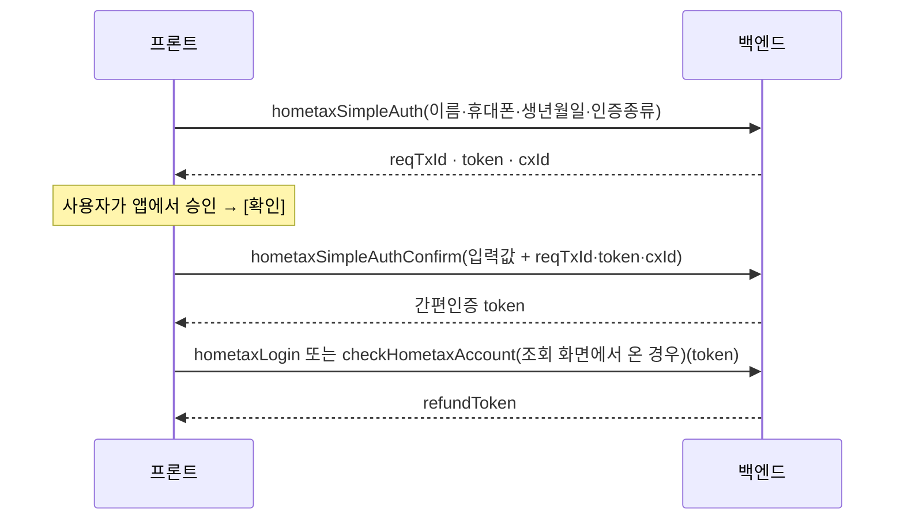
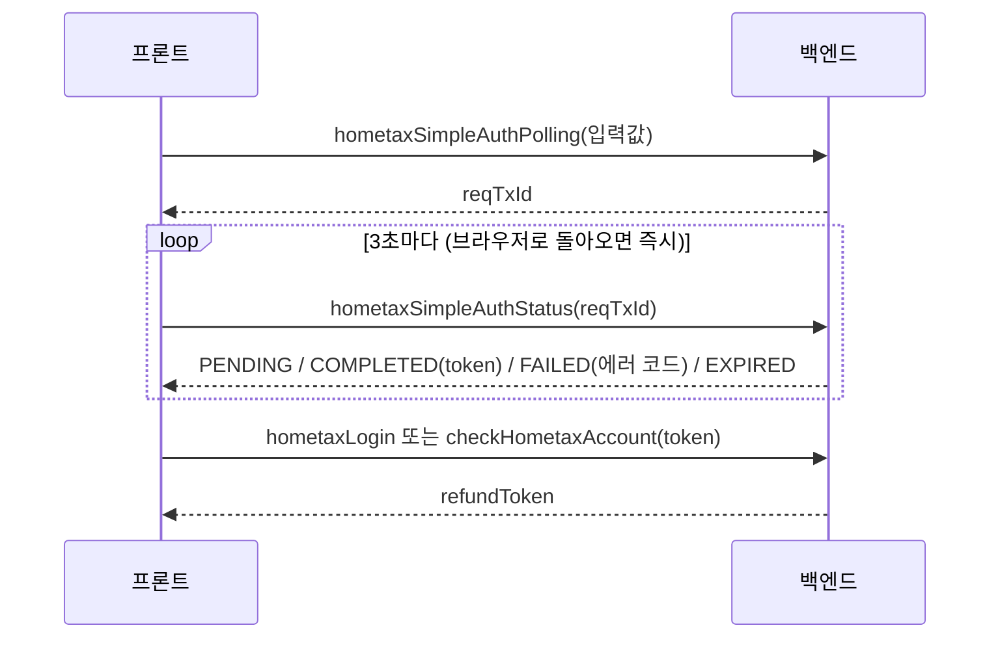
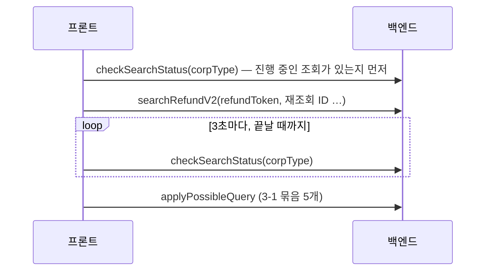

# 환급 웹 GraphQL → REST 전환 작업 문서

> 대상: 환급 사용자 웹 `refund.bznav.com` (`bznav-web/apps/refund-web`) · 기준 `bznav-web` `origin/dev` `dc6d98d29` (2026-10-08)
> 케어 웹(care-web)은 따로 정리한다.

이 폴더는 **백엔드와 프론트가 같이 보고 쓰는 작업판**이다. 백엔드는 REST 를 만들면서 아래 진행표의 `REST`·`백엔드` 칸을 채우고, 프론트는 그 API 로 바꾼 뒤 `프론트` 칸을 체크한다.

## 0. 이렇게 쓴다

**백엔드**
1. [4. 백엔드에 확인할 것](#4-백엔드에-확인할-것)에 먼저 답한다. 응답 형식·에러 형식·인증처럼 API 전체에 걸리는 결정이다
2. 도메인 문서(01~09)를 열어 API 카드마다 **요청 / 응답(프론트가 실제로 읽는 필드만) / 에러 코드**를 보고 REST 를 만든다
3. 만들면 카드와 진행표의 `REST` 칸에 `METHOD /path` 를 적고 `백엔드` 를 ☑. dev 에 배포되면 알려 준다
4. OpenAPI(Swagger) 문서에 올려 주면 프론트가 타입을 자동으로 만든다

**프론트**
1. 도메인 하나가 백엔드 ☑ 이 되면 그 도메인 문서의 **프론트 작업 파일**을 바꾼다 — 도메인 하나 = PR 하나
2. 바꾼 API 의 `프론트` 를 ☑. 같은 API 를 쓰는 파일을 모두 바꿔야 그 API 의 GraphQL 연산을 지울 수 있다
3. 전부 ☑ 이 되면 [6. Relay 걷어내기](#6-프론트--relay-걷어내기-마지막)

**제안하는 순서** (위험이 낮은 것부터, 백엔드 사정에 맞게 바꿔도 된다): 01 공통 → 02 내 정보 → 03 이벤트 → 04 콘텐츠(SSR) → 05 설문 → 06 계좌·결제 → 07 조회 → 08 신청 → 09 홈택스 인증. 전환 기간에는 **GraphQL 과 REST 가 같이 살아 있어야 한다.**

## 1. 숫자

| 항목 | 값 |
|---|---|
| 만들 API (GraphQL 루트 필드) | **79개** |
| 프론트 GraphQL 연산 | 121개 (조회 61 · 변경 60) — 같은 API 를 여러 화면이 다른 필드로 부르기 때문에 API 수보다 많다 |
| 한 요청에 API 여러 개를 묶는 연산 | 9개 ([3-1](#3-1-한-요청에-api-여러-개를-묶어-부르는-곳-9개)) |
| 폴링 | 2곳 (3초) |
| 파일 업로드 | 없음 — 스키마에 `Upload` 타입이 없다 |
| 서버(SSR)에서 부르는 것 | 2개 (로그인 없이) |
| 정의만 있고 안 쓰는 연산 | `updateSurveyMutation` — 만들 필요 없음 |

## 2. 도메인

| 문서 | API | 프론트 작업 파일 |
|---|---|---|
| [01. 공통·화면 설정](./01-common.md) | 11 | 41 |
| [02. 내 정보·마이](./02-me.md) | 7 | 36 |
| [03. 이벤트·프로모션](./03-event.md) | 3 | 4 |
| [04. 콘텐츠 페이지 (서버 렌더링)](./04-content-ssr.md) | 2 | 1 |
| [05. 설문](./05-survey.md) | 14 | 56 |
| [06. 계좌·결제 카드](./06-bank-payment.md) | 9 | 21 |
| [07. 환급 조회](./07-lookup.md) | 11 | 17 |
| [08. 신청·취소](./08-apply.md) | 15 | 24 |
| [09. 홈택스 인증](./09-hometax-auth.md) | 7 | 20 |

## 3. 프론트가 조합해서 쓰는 것 — REST 설계 때 정할 부분

### 3-1. 한 요청에 API 여러 개를 묶어 부르는 곳 (9개)

| 화면 | 프론트 연산 | 묶인 API |
|---|---|---|
| 조회 결과 — 신청 가능 | `applyPossibleQuery` | `checkApplyRefund` · `checkApplyTritxRefund` · `canApplyRefund` · `bznavRefund` · `refundPartner` |
| 설문 시작 (공통 Provider) | `initSurveyQuery` | `bznavRefund` · `getSurveyStatus` · `getSurveyBusinessInfo` · `getSurveyBusinessAnswer` · `getSurveyEmployees` |
| 설문 홈 | `initialSurveyHomeQuery` | `getSurveyStatus` · `getSurveyBusinessInfo` · `getSurveyBusinessAnswer` |
| 환급 홈 — 상태 카드 | `initialSurveyHomeStatusManualSectionQuery` | `getSurveyStatus` · `isCertNeed` · `paymentCards` |
| 환급 홈 | `homeContentQuery` | `getRefundUserMarketingTerm` · `bznavRefund` |
| 마이 | `myInfoQuery` | `bznavRefund` · `checkUserLeave` |
| 설문 — 간판 / 동업자 / 사업장 위치 | `businessSignboardQuery` · `businessPartnerQuery` · `businessLocationQuery` | `getSurveyBusinessInfo` · `getSurveyBusinessAnswer` |

화면용 API 하나로 합치지 않으면 프론트가 병렬로 부른다. 그러면 화면 첫 로딩은 그중 가장 느린 API 만큼 걸린다.

### 3-2. 같은 API 를 여러 화면이 다른 필드로 쓰는 것

| API | 연산 수 | 비고 |
|---|---|---|
| `bznavRefund` | 11 | 내 환급 정보. **프론트가 읽는 필드만 128개** — 홈·메뉴·마이·신청·취소·계좌·설문이 각자 일부만 쓴다 ([02-01](./02-me.md#02-01)) |
| `getSurveyBusinessAnswer` · `upsertBusinessAnswer` | 12 · 11 | 설문 화면마다 자기 문항만 읽고, **바뀐 문항만 저장**한다 |
| `getSurveyBusinessInfo` · `upsertEmploymentAnswer` · `getSurveyEmploymentAnswer` · `getSurveyStatus` | 6 · 5 · 4 · 4 | |

### 3-3. 앞 응답을 다음 요청에 넣는 흐름

**① 간편인증 — 사용자가 [확인]을 누르는 방식** ([09](./09-hometax-auth.md))

**② 간편인증 — 자동 전환 방식(폴링)**

네트워크 실패가 5회 연속이면 폴링을 멈춘다.

**③ 공동인증서** — 사용자 PC 의 인증서 프로그램(`https://127.0.0.1:16566`)과 프론트가 직접 통신해 서명한 뒤 `hometaxLogin` / `checkHometaxAccount`. 백엔드는 마지막 호출만 관련 있다.

**④ 환급 조회** ([07](./07-lookup.md))

**⑤ 신청** ([08](./08-apply.md))
- 종합소득세와 양도세 환급이 같이 있으면 `applyRefund` 와 `tritxApplyRefund` 를 **동시에** 보내고, 둘 다 끝나야 완료다
- 계좌를 바꾸고 신청: `changeBankAccount` → 성공하면 신청
- 간편 신청 링크: `checkBankAccountByCode`(링크 코드·계좌) → `simpleApply`

**⑥ 알림톡 링크로 들어온 추가 조회** — 링크 코드(쿠키)를 넣어 `searchHometaxRefundResult` / `reload` / `loadEmployeeIncrease`. 로그인해서 들어오면 `searchHometaxRefundResultByLogin`.

## 4. 백엔드에 확인할 것

| # | 질문 | 프론트 의견 |
|---|---|---|
| Q1 | 3-1 묶음 9개를 화면용 API 로 합칠지, 따로 둘지 | 환급 홈·설문 시작·신청 가능 3개는 합쳐 주면 좋다 |
| Q2 | `bznavRefund` 를 한 응답으로 둘지, `user` · 환급 목록 · 신청 정보로 쪼갤지 | 쪼개면 홈·메뉴가 가벼워진다 |
| Q3 | 설문 답변을 바뀐 문항만 저장(PATCH)할 수 있는지 | 지금 동작이 그렇다 |
| Q4 | 토큰을 이어 받는 흐름(인증 → refundToken → 조회)을 유지할지 | 유지하면 프론트 변경이 적다 |
| Q5 | 폴링 2곳을 REST 폴링으로 둘지, SSE 등으로 바꿀지 | 폴링 유지가 간단하다 |
| Q6 | 업무 오류를 지금처럼 200 + `{ result, errors: { code, message } }` 로 줄지, HTTP 상태로 줄지 | **200 + 같은 모양**이면 프론트 수정이 훨씬 적다 |
| Q7 | 인증 만료 신호 — 401 인지 (지금은 `errors[].code === 'FORBIDDEN'`) | |
| Q8 | OpenAPI(Swagger) 제공 | 필수 — 프론트 타입 자동 생성 |
| Q9 | 도메인별로 나눠 열지(0절 순서), 전환 기간에 GraphQL 을 유지할지 | 나눠서, 유지 |
| Q10 | `dev-refund.api.zent.kr`(Zent Connect, 운영 콘솔용·관리자 토큰)에 이름이 비슷한 API(광고구좌·랜딩 모달·긴급공지·제휴처·홈택스 차단 설정)가 있다. 사용자용을 따로 만들지, 사용자 토큰에도 열지 | |
| Q11 | 각 도메인 문서의 **설명 한 줄**은 API 이름과 쓰는 곳을 보고 붙였다(스키마에 설명이 없다). 틀린 게 있으면 고쳐 주기 | |

## 5. 지금 요청·응답 규칙

### 5-1. 요청
- `POST` 한 곳(`NEXT_PUBLIC_GQL_API_SERVER`, dev `dev-gateway.api.bznav.com/graphql`)에 JSON `{ query, variables }`
- 로그인한 사용자: `Authorization: Bearer <토큰>` · `X-Zent-Session-Id` · `X-Zent-Client-Session-Id`
- SSR 2개([04](./04-content-ssr.md))는 헤더 없이 서버에서 부른다

### 5-2. 응답
- 대부분 `{ result: boolean, errors: { code, message } | null, ...데이터 }` 모양이고 **HTTP 200** 이다. 프론트는 `result` 와 `errors.code` 로 화면을 나눈다
- GraphQL 오류(`errors[]`)가 오면 첫 메시지를 토스트로 띄운다
- `errors[].code === 'FORBIDDEN'` 이면 로그아웃 처리한다
- 스칼라 `DateTime` 은 문자열, `JSON` 은 객체(설문 답변 일부) — 지금 형식 그대로 유지해 주세요
- enum 은 값 문자열을 프론트가 그대로 비교한다 — 각 도메인 문서의 "enum" 절

### 5-3. 에러 코드

스키마 `ErrorType` 은 58개다. 그중 프론트가 **화면을 나누는 데 쓰는 것**은 코드값을 그대로 유지해 주세요. API 별로는 각 카드의 "프론트가 분기하는 에러 코드" 줄에 있다.

| 영역 | 코드 |
|---|---|
| 홈택스 | `ERR_HOMETAX_SIMPLE_AUTH` · `ERR_HOMETAX_SESSION` · `ERR_HOMETAX_NO_USER` · `ERR_HOMETAX_NO_BMAN` · `ERR_HOMETAX_NO_JUMIN_ID` · `ERR_HOMETAX_IMPOSSIBLE` · `ERR_HOMETAX_SERVER_FIX` · `ERR_HOMETAX_TIMEOUT` · `ERR_HOMETAX_COLLECT` · `ERR_HOMETAX_CALCULATE` · `ERR_HOMETAX_ETC` |
| 조회·신청 | `ERR_NO_EQUAL_TIN` · `ERR_EXIST_FINISH_REFUND` · `ERR_DUPLICATE_APPLY` · `ERR_EXPIRE_URL` · `ERR_BANK_CHANGE_NOT_ALLOWED` · `ERR_ETC` |
| 결제 카드 | `ERR_CARD_NUMBER` · `ERR_CARD_EXPIRED` · `ERR_CARD_PASSWORD` · `ERR_CARD_PASSWORD_FIVE_TIMES` · `ERR_CARD_BIRTH` · `ERR_HECTO_ETC` |
| 설문 | `ERR_SURVEY_EXPIRED` · `ERR_SURVEY_COMPLETED` · `ERR_UPDATE_SURVEY_ANSWER` |
| 상수로 정의만 있음 | `ERR_HOMETAX_PASSWORD` · `ERR_HOMETAX_BLOCK_ID` · `ERR_HOMETAX_NO_CORPS_ID` · `ERR_HOMETAX_INPUT` · `ERR_HOMETAX_EXPIRE_CERT` · `ERR_HOMETAX_NO_REGIST_CERT` · `ERR_EXIST_SEARCH_HISTORY` · `ERR_NOT_EXIST_HISTORY` · `ERR_NOT_EXIST_YEAR_END_TAX_SETTLEMENT` · `ERR_NOT_EXIST_RETURNS` · `ERR_LAMBDA_MESSAGE_BYPASS` |

프론트 정의: `apps/refund-web/components/tax-refund/common/error/error.ts`

ErrorType 전체 58개

`ERR_HOMETAX_PASSWORD` · `ERR_HOMETAX_BLOCK_ID` · `ERR_HOMETAX_NO_CORPS_ID` · `ERR_HOMETAX_NO_JUMIN_ID` · `ERR_HOMETAX_IMPOSSIBLE` · `ERR_HOMETAX_SERVER_FIX` · `ERR_HOMETAX_COLLECT` · `ERR_HOMETAX_CALCULATE` · `ERR_HOMETAX_SESSION` · `ERR_HOMETAX_INPUT` · `ERR_HOMETAX_NO_INCOME_TAX` · `ERR_DUPLICATE_APPLY` · `ERR_HOMETAX_ETC` · `ERR_HOMETAX_EXPIRE_CERT` · `ERR_HOMETAX_NO_REGIST_CERT` · `ERR_EXIST_SEARCH_HISTORY` · `ERR_EXIST_FINISH_REFUND` · `ERR_HOMETAX_NO_USER` · `ERR_HOMETAX_NO_CONTINUE_BMAN` · `ERR_HOMETAX_NO_BMAN` · `ERR_HOMETAX_SIMPLE_AUTH` · `ERR_HOMETAX_REG_NO` · `ERR_HOMETAX_TIMEOUT` · `ERR_HOMETAX_PASSWORD_CHANGE_REQUEST` · `ERR_HOMETAX_SECOND_AUTH` · `ERR_NO_EQUAL_TIN` · `ERR_EXPIRE_URL` · `ERR_NOT_EXIST_HISTORY` · `ERR_NOT_EXIST_YEAR_END_TAX_SETTLEMENT` · `ERR_ETC` · `ERR_PROMOTION` · `ERR_USER` · `ERR_NON_PRODUCT_PROMOTION` · `ERR_SSO` · `ERR_SURVEY` · `ERR_SURVEY_ANSWER` · `ERR_UPDATE_SURVEY_ANSWER` · `ERR_SURVEY_EXPIRED` · `ERR_SURVEY_COMPLETED` · `ERR_LEAVE_REASON` · `ERR_LEAVE_REASON_LOG` · `ERR_HOMETAX_OVERLOAD` · `ERR_USER_PHONE` · `ERR_CREATE_SURVEY_ANSWER` · `ERR_USER_ACTION_LOG` · `ERR_CARD_NUMBER` · `ERR_CARD_EXPIRED` · `ERR_CARD_PASSWORD` · `ERR_CARD_PASSWORD_FIVE_TIMES` · `ERR_CARD_BIRTH` · `ERR_HECTO_ETC` · `ERR_ADSLOT` · `ERR_CONTENT_PAGE` · `ERR_BANK_CODE_NOT_FOUND` · `ERR_CLIENT_SURVEY` · `ERR_CLIENT_SURVEY_ANSWER` · `ERR_BANK_CHANGE_NOT_ALLOWED` · `ERR_NOT_HOMETAX_MAINTENANCE_TIME`

## 6. 프론트 — Relay 걷어내기 (마지막)

모든 API 의 `프론트` 가 ☑ 이 된 뒤에 한다.

- [ ] `graphql/` 폴더 (query · mutation · schema · `__generated__`)
- [ ] `lib/relay/` (`relay-environment.ts` · `relay-loggers.ts` · `use-fetch-relay-factory.ts`)
- [ ] `components/common/RelayEdkForAccessTokenProvider.tsx` 와 이걸 쓰는 `components/layout/RefundAppContents.tsx`
- [ ] `lib/graphql/server-fetch.ts` (SSR 2개를 REST 로 바꾼 뒤)
- [ ] `relay.config.json`, `next.config.mjs` 의 `relay` 블록
- [ ] `package.json` 스크립트 `gen:relay` · `gen:schema` · `gen:api`, `dev`·`build` 앞의 `pnpm gen:relay`
- [ ] 의존성 `react-relay` · `relay-runtime` · `@types/*` · `graphql`. 버전은 catalog 라 **care-web 도 다 바꾼 뒤** 루트 `pnpm-workspace.yaml` 에서 뺀다
- [ ] 로그인 안 된 화면에서 Relay 때문에 둔 `<Suspense>` 경계 정리

## 7. 진행표 (79)

| ID | 도메인 | API | 종류 | 설명 | REST (백엔드 기입) | 백엔드 | 프론트 |
|---|---|---|---|---|---|---|---|
| [01-01](./01-common.md#01-01) | 공통·화면 설정 | `getAdSlots` | 조회 | 광고 구좌(배너) 조회 | | ☐ | ☐ |
| [01-02](./01-common.md#01-02) | 공통·화면 설정 | `landingModal` | 조회 | 랜딩 모달 조회 | | ☐ | ☐ |
| [01-03](./01-common.md#01-03) | 공통·화면 설정 | `notice` | 조회 | 긴급 공지 조회 | | ☐ | ☐ |
| [01-04](./01-common.md#01-04) | 공통·화면 설정 | `refundPartner` | 조회 | 제휴처(파트너) 정보 조회 | | ☐ | ☐ |
| [01-05](./01-common.md#01-05) | 공통·화면 설정 | `hometaxBlockSettings` | 조회 | 홈택스 차단(대기열) 설정 조회 | | ☐ | ☐ |
| [01-06](./01-common.md#01-06) | 공통·화면 설정 | `hometaxBlockNotificationStatus` | 조회 | 홈택스 차단 해제 알림 신청 여부 조회 | | ☐ | ☐ |
| [01-07](./01-common.md#01-07) | 공통·화면 설정 | `requestHometaxBlockNotification` | 변경 | 홈택스 차단 해제 알림 신청 | | ☐ | ☐ |
| [01-08](./01-common.md#01-08) | 공통·화면 설정 | `reserveHometaxMaintenanceExitAlimtalk` | 변경 | 홈택스 점검 종료 알림톡 예약 | | ☐ | ☐ |
| [01-09](./01-common.md#01-09) | 공통·화면 설정 | `saveRefundActionLog` | 변경 | 사용자 행동 로그 저장 | | ☐ | ☐ |
| [01-10](./01-common.md#01-10) | 공통·화면 설정 | `molocoConversionStatus` | 조회 | 몰로코 전환 이벤트 전송 여부 조회 | | ☐ | ☐ |
| [01-11](./01-common.md#01-11) | 공통·화면 설정 | `markMolocoConversionSent` | 변경 | 몰로코 전환 이벤트 전송 기록 | | ☐ | ☐ |
| [02-01](./02-me.md#02-01) | 내 정보·마이 | `bznavRefund` | 조회 | 내 환급 정보(유저·환급 이력) 조회 | | ☐ | ☐ |
| [02-02](./02-me.md#02-02) | 내 정보·마이 | `checkUserLeave` | 조회 | 탈퇴 관련 확인 | | ☐ | ☐ |
| [02-03](./02-me.md#02-03) | 내 정보·마이 | `getRefundUserMarketingTerm` | 조회 | 마케팅 수신 동의 조회 | | ☐ | ☐ |
| [02-04](./02-me.md#02-04) | 내 정보·마이 | `updateRefundUserMarketingTerms` | 변경 | 마케팅 수신 동의 변경 | | ☐ | ☐ |
| [02-05](./02-me.md#02-05) | 내 정보·마이 | `checkRefundUserPassword` | 조회 | 환급 비밀번호 확인 | | ☐ | ☐ |
| [02-06](./02-me.md#02-06) | 내 정보·마이 | `updateRefundUserPassword` | 변경 | 환급 비밀번호 변경 | | ☐ | ☐ |
| [02-07](./02-me.md#02-07) | 내 정보·마이 | `getRefundHistoryId` | 조회 | 환급 이력 ID 조회 | | ☐ | ☐ |
| [03-01](./03-event.md#03-01) | 이벤트·프로모션 | `getRefundUserPromotion` | 조회 | 내 프로모션 조회 | | ☐ | ☐ |
| [03-02](./03-event.md#03-02) | 이벤트·프로모션 | `getRefundUserPromotionHistory` | 조회 | 프로모션(초대) 이력 조회 | | ☐ | ☐ |
| [03-03](./03-event.md#03-03) | 이벤트·프로모션 | `createRefundPromotionTermsLog` | 변경 | 프로모션 약관 동의 기록 | | ☐ | ☐ |
| [04-01](./04-content-ssr.md#04-01) | 콘텐츠 페이지 (서버 렌더링) | `getRefundContentPage` | 조회 | 콘텐츠(랜딩) 페이지 조회 — 서버에서 로그인 없이 | | ☐ | ☐ |
| [04-02](./04-content-ssr.md#04-02) | 콘텐츠 페이지 (서버 렌더링) | `getRefundContentPageSitemap` | 조회 | 사이트맵용 콘텐츠 페이지 목록 — 서버에서 로그인 없이 | | ☐ | ☐ |
| [05-01](./05-survey.md#05-01) | 설문 | `getSurvey` | 조회 | 설문 조회 | | ☐ | ☐ |
| [05-02](./05-survey.md#05-02) | 설문 | `getSurveyTarget` | 조회 | 설문 대상 조회 | | ☐ | ☐ |
| [05-03](./05-survey.md#05-03) | 설문 | `getSurveyStatus` | 조회 | 설문 진행 상태 조회 | | ☐ | ☐ |
| [05-04](./05-survey.md#05-04) | 설문 | `getSurveyAddress` | 조회 | 주소(법정동) 조회 | | ☐ | ☐ |
| [05-05](./05-survey.md#05-05) | 설문 | `getSurveyBusinessInfo` | 조회 | 사업장 정보 조회 | | ☐ | ☐ |
| [05-06](./05-survey.md#05-06) | 설문 | `getSurveyBusinessAnswer` | 조회 | 사업 문항 답변 조회 | | ☐ | ☐ |
| [05-07](./05-survey.md#05-07) | 설문 | `getSurveyEmployees` | 조회 | 직원 목록 조회 | | ☐ | ☐ |
| [05-08](./05-survey.md#05-08) | 설문 | `getSurveyEmploymentAnswer` | 조회 | 고용 문항 답변 조회 | | ☐ | ☐ |
| [05-09](./05-survey.md#05-09) | 설문 | `isCertNeed` | 조회 | 추가 인증 필요 여부 조회 | | ☐ | ☐ |
| [05-10](./05-survey.md#05-10) | 설문 | `putSurveyAnswer` | 변경 | 설문 답변 저장(put) | | ☐ | ☐ |
| [05-11](./05-survey.md#05-11) | 설문 | `saveSurveyAnswer` | 변경 | 설문 답변 저장(save) | | ☐ | ☐ |
| [05-12](./05-survey.md#05-12) | 설문 | `submitSurvey` | 변경 | 설문 제출 | | ☐ | ☐ |
| [05-13](./05-survey.md#05-13) | 설문 | `upsertBusinessAnswer` | 변경 | 사업 문항 답변 부분 저장 | | ☐ | ☐ |
| [05-14](./05-survey.md#05-14) | 설문 | `upsertEmploymentAnswer` | 변경 | 고용 문항 답변 부분 저장 | | ☐ | ☐ |
| [06-01](./06-bank-payment.md#06-01) | 계좌·결제 카드 | `bankList` | 조회 | 은행 목록 조회 | | ☐ | ☐ |
| [06-02](./06-bank-payment.md#06-02) | 계좌·결제 카드 | `checkBankAccount` | 변경 | 계좌 확인(예금주) | | ☐ | ☐ |
| [06-03](./06-bank-payment.md#06-03) | 계좌·결제 카드 | `checkBankAccountByCode` | 변경 | 링크 코드로 계좌 확인(간편 신청) | | ☐ | ☐ |
| [06-04](./06-bank-payment.md#06-04) | 계좌·결제 카드 | `changeBankAccount` | 변경 | 환급 계좌 변경 | | ☐ | ☐ |
| [06-05](./06-bank-payment.md#06-05) | 계좌·결제 카드 | `paymentCards` | 조회 | 등록된 결제 카드 조회 | | ☐ | ☐ |
| [06-06](./06-bank-payment.md#06-06) | 계좌·결제 카드 | `checkNeedPaymentCard` | 조회 | 결제 카드 등록 필요 여부 | | ☐ | ☐ |
| [06-07](./06-bank-payment.md#06-07) | 계좌·결제 카드 | `refundPaymentCardLink` | 조회 | 결제 카드 등록 링크 정보(TRP) | | ☐ | ☐ |
| [06-08](./06-bank-payment.md#06-08) | 계좌·결제 카드 | `createPaymentCard` | 변경 | 결제 카드 등록 | | ☐ | ☐ |
| [06-09](./06-bank-payment.md#06-09) | 계좌·결제 카드 | `updatePaymentCard` | 변경 | 결제 카드 변경 | | ☐ | ☐ |
| [07-01](./07-lookup.md#07-01) | 환급 조회 | `searchRefundV2` | 변경 | 환급 조회 시작 | | ☐ | ☐ |
| [07-02](./07-lookup.md#07-02) | 환급 조회 | `checkSearchStatus` | 조회 | 조회 진행 상태 확인(폴링) | | ☐ | ☐ |
| [07-03](./07-lookup.md#07-03) | 환급 조회 | `checkRefund` | 조회 | 종합소득세 환급 조회 결과 확인 | | ☐ | ☐ |
| [07-04](./07-lookup.md#07-04) | 환급 조회 | `checkTritxRefund` | 조회 | 양도세 환급 조회 결과 확인 | | ☐ | ☐ |
| [07-05](./07-lookup.md#07-05) | 환급 조회 | `checkLookPage` | 변경 | 결과 화면 열람 확인·기록 | | ☐ | ☐ |
| [07-06](./07-lookup.md#07-06) | 환급 조회 | `searchHometaxRefundResult` | 변경 | 알림톡 링크로 환급 결과 조회 | | ☐ | ☐ |
| [07-07](./07-lookup.md#07-07) | 환급 조회 | `searchHometaxRefundResultByLogin` | 변경 | 로그인 상태로 환급 결과 조회 | | ☐ | ☐ |
| [07-08](./07-lookup.md#07-08) | 환급 조회 | `reload` | 변경 | 알림톡 링크로 다시 수집 | | ☐ | ☐ |
| [07-09](./07-lookup.md#07-09) | 환급 조회 | `loadEmployeeIncrease` | 변경 | 고용 증대 추가 수집 | | ☐ | ☐ |
| [07-10](./07-lookup.md#07-10) | 환급 조회 | `searchPersonalDeductionByLogin` | 변경 | 인적공제 수집 | | ☐ | ☐ |
| [07-11](./07-lookup.md#07-11) | 환급 조회 | `applyRefundPossibleAlarm` | 변경 | 환급 가능 알림 신청 | | ☐ | ☐ |
| [08-01](./08-apply.md#08-01) | 신청·취소 | `canApplyRefund` | 조회 | 신청 가능 여부 확인 | | ☐ | ☐ |
| [08-02](./08-apply.md#08-02) | 신청·취소 | `checkApplyRefund` | 조회 | 종합소득세(·법인) 신청 정보 확인 | | ☐ | ☐ |
| [08-03](./08-apply.md#08-03) | 신청·취소 | `checkApplyTritxRefund` | 조회 | 양도세 신청 정보 확인 | | ☐ | ☐ |
| [08-04](./08-apply.md#08-04) | 신청·취소 | `applyRefund` | 변경 | 종합소득세(·법인) 환급 신청 | | ☐ | ☐ |
| [08-05](./08-apply.md#08-05) | 신청·취소 | `tritxApplyRefund` | 변경 | 양도세 환급 신청 | | ☐ | ☐ |
| [08-06](./08-apply.md#08-06) | 신청·취소 | `simpleApply` | 변경 | 간편 신청(링크) | | ☐ | ☐ |
| [08-07](./08-apply.md#08-07) | 신청·취소 | `cancelReasonsV2` | 조회 | 취소 사유 목록 | | ☐ | ☐ |
| [08-08](./08-apply.md#08-08) | 신청·취소 | `applyCancel` | 변경 | 신청 취소 | | ☐ | ☐ |
| [08-09](./08-apply.md#08-09) | 신청·취소 | `tritxApplyCancel` | 변경 | 양도세 신청 취소 | | ☐ | ☐ |
| [08-10](./08-apply.md#08-10) | 신청·취소 | `revokeCancel` | 변경 | 취소 철회 | | ☐ | ☐ |
| [08-11](./08-apply.md#08-11) | 신청·취소 | `tritxRevokeCancel` | 변경 | 양도세 취소 철회 | | ☐ | ☐ |
| [08-12](./08-apply.md#08-12) | 신청·취소 | `getApplyRefundCertificate` | 조회 | 신청 확인서 조회 | | ☐ | ☐ |
| [08-13](./08-apply.md#08-13) | 신청·취소 | `createApplyRefundCertificate` | 변경 | 신청 확인서 생성 | | ☐ | ☐ |
| [08-14](./08-apply.md#08-14) | 신청·취소 | `getDeligationInfoOfUser` | 조회 | 위임 정보 조회 | | ☐ | ☐ |
| [08-15](./08-apply.md#08-15) | 신청·취소 | `saveApplyRefundDelegationFiles` | 변경 | 위임장·서명 저장 | | ☐ | ☐ |
| [09-01](./09-hometax-auth.md#09-01) | 홈택스 인증 | `hometaxSimpleAuth` | 변경 | 간편인증 요청(사용자가 [확인]을 누르는 방식) | | ☐ | ☐ |
| [09-02](./09-hometax-auth.md#09-02) | 홈택스 인증 | `hometaxSimpleAuthPolling` | 변경 | 간편인증 요청(자동 전환 방식) | | ☐ | ☐ |
| [09-03](./09-hometax-auth.md#09-03) | 홈택스 인증 | `hometaxSimpleAuthStatus` | 조회 | 간편인증 진행 상태 확인(폴링) | | ☐ | ☐ |
| [09-04](./09-hometax-auth.md#09-04) | 홈택스 인증 | `hometaxSimpleAuthConfirm` | 변경 | 간편인증 승인 확인 → 간편인증 토큰 | | ☐ | ☐ |
| [09-05](./09-hometax-auth.md#09-05) | 홈택스 인증 | `hometaxLogin` | 변경 | 홈택스 로그인 → 조회 토큰(refundToken) | | ☐ | ☐ |
| [09-06](./09-hometax-auth.md#09-06) | 홈택스 인증 | `checkHometaxAccount` | 변경 | 홈택스 계정 확인 → 조회 토큰(refundToken) · 조회 화면용 | | ☐ | ☐ |
| [09-07](./09-hometax-auth.md#09-07) | 홈택스 인증 | `sendCommonCertPcLink` | 변경 | 공동인증서 PC 링크 발송 | | ☐ | ☐ |

---

이 폴더의 01~09 문서는 코드에서 자동으로 뽑았다(`tools/gen.cjs`). 코드가 바뀌면 다시 만들 수 있지만, **다시 만들면 손으로 적은 `REST` 칸과 체크가 지워진다.** 진행 기록은 이 README 의 진행표에 남긴다.
